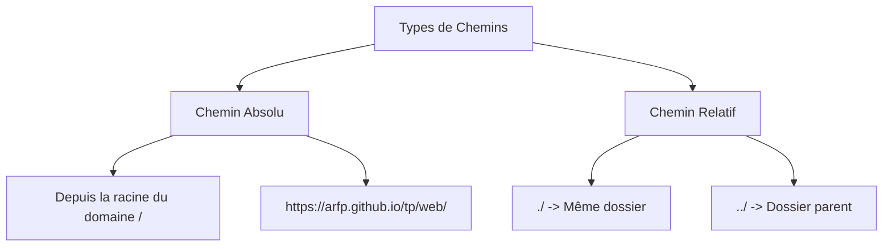

# Les Chemins en Développement Web (Paths)

Comprendre les chemins est essentiel pour lier les fichiers (HTML, CSS, JS, images) entre eux sans erreur.

---

## 1. Concept : Chemin Absolu vs Chemin Relatif



### Le Chemin Absolu

Il indique un emplacement unique et fixe. Il ne dépend pas de la position du fichier qui l'appelle.

| Contexte | Syntaxe | 
| --- | --- | 
| **Internet (URL globale)** | `https://mon-site.fr/images/logo.png`<br>Une ressource précise et unique sur le web. | 
| **Serveur / Application Web** | `/images/logo.png` <br> Le `/` initial signifie "repartir de la racine du site web". |
| **Système GNU/Linux / macOS** | `/images/logo.png` <br> Le `/` initial signifie "repartir de la racine du système". |
| **Système Windows** | `C:\images\logo.png` <br> Le `C:\` initial signifie "repartir depuis la racine du lecteur C". |

### Le Chemin Relatif

Il dépend de la position du fichier actuel (le fichier dans lequel vous écrivez le code). On se déplace *relativement* à lui.

* `./` : Signifie "dans le dossier courant" (souvent facultatif).
* `../` : Signifie "remonter d'un dossier" (le dossier parent).

---

## 2. Résolution dans une Application Web

Voici comment le navigateur ou le serveur résout ces chemins selon le contexte.

### A. La balise `<link>` (Styles CSS)

Placée dans le `<head>` de votre HTML, elle demande au navigateur de télécharger une feuille de style.

* **Exemple (Relatif) :** Si votre HTML est à la racine et le CSS dans un dossier `css/`.
```html
<link rel="stylesheet" href="./css/main.css">
```


* **Exemples (Absolu) :** Utile pour les architectures complexes ou les CDN.
```html
<link rel="stylesheet" href="/assets/css/main.css">
<link rel="stylesheet" href="https://mondomaine.fr/css/main.css">
```


### B. La balise `<script src="...">` (Scripts JavaScript)

Le navigateur télécharge et exécute le script.

* **Structure cible :**
```text
├── index.html
└── js/
    └── app.js

```


* **Code dans index.html :**
```html
<script src="./js/app.js" defer></script>

```


### C. L'import de module JS (`import ... from ...`)

Ici, c'est le moteur JavaScript (ou un outil comme Vite/Webpack) qui résout le chemin.

**Règle stricte en JS moderne :** Les chemins relatifs doivent obligatoirement commencer par `./` ou `../`. Un nom direct sans slash cherche un package dans `node_modules`.

* **Structure cible :**
```text
└── src/
    ├── index.js
    └── components/
        └── button.js

```


* **Code dans index.js :**
```javascript
import { Button } from './components/button.js';
```


### D. Les inclusions en PHP (`include`, `require`)

En PHP, les chemins sont résolus côté serveur au moment de l'exécution du script et non par le navigateur. 

**Le piège classique :** Si vous utilisez un chemin relatif simple comme `include 'header.php';`, PHP cherche le fichier relativement au script *initialement appelé* par le navigateur, ce qui peut casser vos inclusions si vous changez de sous-dossier.

Pour sécuriser vos inclusions, la bonne pratique est de construire un chemin absolu sur le serveur en utilisant la constante magique [\_\_DIR__](https://www.php.net/manual/en/language.constants.magic.php).

* **Structure cible :**
```text
├── index.php
└── inc/
    └── header.php
```

* **Code dans index.php :**

```php
<?php
// __DIR__ donne le chemin absolu du dossier contenant le fichier actuel
require_once __DIR__ . '/inc/header.php';
?>
```

#### L'évolution PHP : L'autochargement avec Composer

Dans les projets PHP modernes (comme avec Symfony ou l'architecture MVC), on évite d'écrire manuellement des dizaines de lignes `require_once`. On confie cette tâche à **Composer** et à son système d'**autoloading** ([norme PSR-4](https://www.php-fig.org/psr/)). Il suffit d'inclure un seul fichier unique au point d'entrée de l'application :

```php
<?php
// Un seul require pour charger automatiquement toutes les classes du projet
require_once __DIR__ . '/vendor/autoload.php';
```


## 3. Synthèse

| Environnement / Technologie | Mécanisme de résolution | Règle d'or |
| --- | --- | --- |
| **HTML (`<link>`, ``, `<a>`)** | Résolu par le **navigateur** | Le `/` initial pointe vers la racine du domaine web. |
| **JavaScript (`import`)** | Résolu par le **moteur JS** ou le *bundler* (Vite) | Obligation d'utiliser `./` ou `../` pour les fichiers locaux. |
| **PHP (`include`, `require`)** | Résolu par le **serveur** | Utiliser `__DIR__` pour résoudre le chemin absolu du répertoire du script courant. |

## Ressources 

<iframe width="800" height="450" src="https://www.youtube.com/watch?v=4WOVQ0rw3K8" title="YouTube video player" frameborder="0" allow="accelerometer; autoplay; clipboard-write; encrypted-media; gyroscope; picture-in-picture; web-share" referrerpolicy="strict-origin-when-cross-origin" allowfullscreen></iframe>
