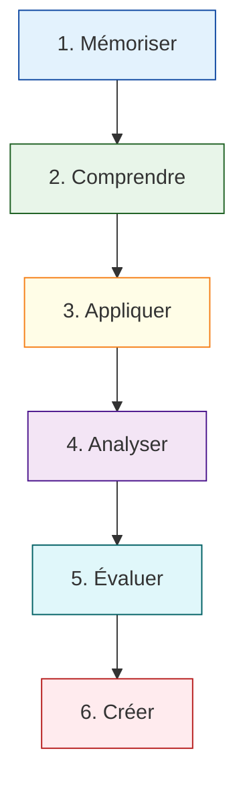

# CP1 - Installer et configurer son environnement de travail en fonction du projet

### Principes d'accessibilité inclus dans ce plan :

* **Balises de repère visuel (Emoji-Scaffolding) :** Chaque niveau d'action possède un repère visuel constant pour éviter la surcharge cognitive.
* **Séquençage strict :** Pas de phrases complexes, une seule action par sous-étape.
* **Explicitation des implicites :** Les termes techniques ou contextuels (ex: pourquoi utiliser l'anglais, qu'est-ce qu'un dépôt) sont directement intégrés et clarifiés sans ambiguïté.

---

# Plan de module : Compétence Professionnelle 1 (CP1)

Installer et configurer son environnement de travail en fonction du projet web ou web mobile 

---

## Niveau 1 : Mémoriser (Restituer les termes et les composants)

**Objectif général :** Identifier visuellement et nommer les outils informatiques requis par le projet.

### Sous-module 1.1 : La boîte à outils du Développeur

**Objectif :** Comprendre l'utilité les 4 familles d'outils indispensables :    

1. Éditeur de code (IDE)
2. Gestionnaire de versions (Git)
3. Conteneuriseur (Docker)
4. Terminal

### Sous-module 1.2 : Le lexique technique bilingue

**Objectif :** Associer les mots techniques anglais du REAC à leur traduction française exacte.

1. Associer *« Repository »* à *« Dépôt de code »*.
2. Associer *« Commit »* à *« Enregistrement d'un instantané de code »*.
3. Associer *« Pull / Push »* à *« Récupérer / Envoyer le code »*.

---

### Niveau 2 : Comprendre (Saisir le sens des concepts)

Objectif général : Expliquer le fonctionnement logique de l'infrastructure locale et collaborative.

* **🧩 Sous-module 2.1 : Le fonctionnement de Git et de la collaboration**
* 
**🎯 Objectif cible :** Expliquer avec un schéma simple le parcours du code, du poste local vers le dépôt distant.

* **📋 Éléments décomposés :**
1. Décrire la différence entre l'espace de travail local (mon ordinateur) et le serveur distant (GitHub/GitLab).

2. Expliquer pourquoi on ne partage jamais son code par email ou clé USB (risques de conflits).

* **🧩 Sous-module 2.2 : Le concept de conteneur (Docker)**
* 
**🎯 Objectif cible :** Expliquer l'utilité d'un conteneur par rapport à l'environnement de production finale.

* **📋 Éléments décomposés :**
1. Définir le conteneur comme une « boîte étanche » qui contient un service (ex: une base de données MySQL).

2. Formuler l'avantage : garantir que le code fonctionne de la même manière sur l'ordinateur de l'apprenant et sur le serveur de production (concept d'iso-environnement).

---

### ⚙️ Niveau 3 : Appliquer (Exécuter les procédures d'installation)

Objectif général : Réaliser pas à pas l'installation des logiciels en suivant une documentation visuelle.

* **🧩 Sous-module 3.1 : Installation guidée de l'environnement de base**
* 
**🎯 Objectif cible :** Installer l'IDE, Git et Docker sur son système d'exploitation sans erreur de parcours.

* **📋 Éléments décomposés (Structure visuelle forte) :**
1. Ouvrir la fiche de procédure numéro 1.
2. Télécharger la version compatible avec le système (Windows/WSL/macOS).
3. Cocher les cases de configuration recommandées lors de l'installation (captures d'écran à l'appui).
4. Ouvrir le terminal et taper les commandes de vérification : `git --version` et `docker --version`.

* **🧩 Sous-module 3.2 : Premier clonage et configuration Git**
* 
**🎯 Objectif cible :** Configurer son identité globale Git et cloner son premier projet.

* **📋 Éléments décomposés :**
1. Configurer son nom et son adresse email professionnelle dans le terminal.
2. Générer une clé d'authentification sécurisée (SSH) pour l'outil collaboratif.

3. Exécuter la commande `git clone [adresse_du_depot]`.

---

### 🔍 Niveau 4 : Analyser (Diagnostiquer et lier les configurations)

Objectif général : Détecter les anomalies d'installation et décortiquer les fichiers de configuration.

* **🧩 Sous-module 4.1 : Lecture active du dossier de conception**
* 
**🎯 Objectif cible :** Extraire d'un dossier de conception technique les prérequis matériels et logiciels nécessaires.

* **📋 Éléments décomposés :**
1. Parcourir le cahier des charges textuel.
2. Remplir un tableau de synthèse à trois colonnes : `Langage & Version` | `Type de Base de données` | `Ports réseau requis`.

* **🧩 Sous-module 4.2 : Analyse de pannes d'environnement (Troubleshooting)**
* **🎯 Objectif cible :** Identifier la cause d'un démarrage manqué de l'environnement à l'aide des journaux d'erreurs (*logs*).
* **📋 Éléments décomposés :**
1. Lire le message d'erreur renvoyé par le terminal.
2. Isoler les mots-clés de l'erreur (ex: *« Port 8080 is already in use »* ou *« Access denied for user »*).

3. Associer l'erreur au bon composant (conflit de port = réseau, access denied = base de données).

---

### ⚖️ Niveau 5 : Évaluer (Vérifier la conformité et la sécurité)

Objectif général : Contrôler la qualité de son installation par rapport aux critères du référentiel d'évaluation.

* **🧩 Sous-module 5.1 : Recette de l'environnement de travail**
* 
**🎯 Objectif cible :** Valider la conformité de son poste de travail via une grille d'auto-évaluation stricte.

* **📋 Éléments décomposés :**
1. Tester l'accès local au serveur web via le navigateur (Vérification du code HTTP 200).
2. Vérifier la persistance des données : arrêter le conteneur, le redémarrer, contrôler que les données de test sont toujours présentes.

* **🧩 Sous-module 5.2 : Audit de sécurité de premier niveau**
* 
**🎯 Objectif cible :** Repérer et corriger les vulnérabilités majeures de configuration locale (Recommandations ANSSI / RGPD).

* **📋 Éléments décomposés :**
1. Vérifier qu'aucun mot de passe sensible n'est écrit directement en clair dans les fichiers de configuration partagés (Utilisation obligatoire d'un fichier `.env.local` ignoré par Git).
2. Activer l'utilitaire de contrôle de qualité de code (Linter) et corriger les alertes de syntaxe.

---

### 🏗️ Niveau 6 : Créer (Construire et adapter l'environnement)

Objectif général : Structurer l'environnement complet pour un nouveau projet web spécifique.

* **🧩 Sous-module 6.1 : Écriture du script d'orchestration (Docker Compose)**
* 
**🎯 Objectif cible :** Rédiger un fichier `docker-compose.yml` fonctionnel pour monter une architecture Stack (ex: Apache/PHP/PostgreSQL).

* **📋 Éléments décomposés :**
1. Déclarer les services nécessaires dans le fichier de configuration.

2. Configurer les volumes locaux pour l'arborescence des fichiers du projet.
3. Exécuter l'environnement global via une commande unique dans le terminal.

* **🧩 Sous-module 6.2 : Rédaction de la documentation d'accueil (README.md)**
* 
**🎯 Objectif cible :** Produire le guide technique pas à pas permettant à un autre développeur de cloner et lancer l'environnement en moins de 3 commandes.

* **📋 Éléments décomposés :**
1. Rédiger en Markdown clair les prérequis logiciels requis.

2. Lister les blocs de commandes exacts à copier-coller pour l'installation.

3. Indiquer les URLs locales d'accès aux services et aux bases de données pour l'équipe.

---

⏱️ Modalités d'évaluation formative (Conformes au REV2) 

Pour préparer sereinement les profils TSA/TDAH aux conditions de l'examen officiel sans générer d'anxiété de performance, deux formats d'entraînements progressifs sont mis en place :

1. 
**Le Questionnaire Technique d'Entraînement :** Exercice de lecture d'une documentation technique en anglais avec questions fermées à choix unique et questions à réponses courtes.

2. 
**La Simulation d'Entretien Technique :** Présentation orale de 5 minutes de sa structure de fichiers et de son fichier d'orchestration devant ses pairs, suivie de questions de diagnostic simples.