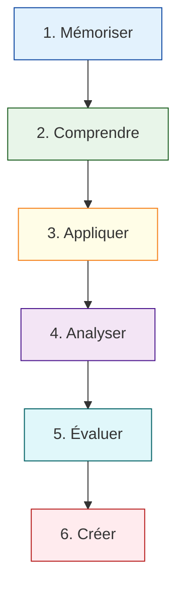

# DWWM CP02 : Maquetter des interfaces utilisateur web ou web mobile

---

# 🎨 Plan de module : Compétence Professionnelle 2 (CP2)

## Maquetter des interfaces utilisateur web ou web mobile

---

### 📥 Niveau 1 : Mémoriser (Identifier et nommer)

*Objectif général : Connaître le vocabulaire et les outils du design d'interface.*

* **🧩 Sous-module 1.1 : Les composants d'interface (UI)**
* **🎯 Objectif cible :** Nommer sans erreur les éléments visuels standards d'une page web.
* **📋 Actions décomposées :**
1. Identifier visuellement un menu de navigation (Navbar).
2. Repérer le pied de page (Footer) et les boutons d'action (CTA).
3. Nommer les champs d'un formulaire (Input, Select, Checkbox).

* **🧩 Sous-module 1.2 : Le logiciel de maquettage (ex: Figma)**
* **🎯 Objectif cible :** Situer les fonctions de base dans l'interface du logiciel.
* **📋 Actions décomposées :**
1. Localiser la barre des calques (Layers).
2. Identifier l'outil "Cadre" (Frame) et l'outil "Forme" (Rectangle).
3. Pointer le panneau des propriétés (Inspecter/Design).

---

### 💡 Niveau 2 : Comprendre (Expliquer les concepts)

*Objectif général : Saisir les principes d'ergonomie et d'accessibilité numérique.*

* **🧩 Sous-module 2.1 : L'expérience utilisateur (UX)**
* **🎯 Objectif cible :** Expliquer pourquoi une interface doit être simple et accessible.
* **📋 Actions décomposées :**
1. Définir le rôle d'une *User Story* (Ce que l'utilisateur veut faire).
2. Expliquer le principe de la hiérarchie visuelle (Ce que l'œil doit voir en premier).
3. Citer les 3 critères de base de l'accessibilité : contraste, taille de texte, zones de clic.

---

### ⚙️ Niveau 3 : Appliquer (Exécuter les gestes techniques)

*Objectif général : Manipuler les outils pour reproduire une structure visuelle.*

* **🧩 Sous-module 3.1 : Création d'un Wireframe (Basse fidélité)**
* **🎯 Objectif cible :** Construire le squelette d'une page web sans couleur ni image.
* **📋 Actions décomposées :**
1. Tracer les zones de contenu avec des rectangles gris.
2. Placer le logo, le menu et le corps de page selon un modèle fourni.
3. Respecter les marges et les espacements simples.

* **🧩 Sous-module 3.2 : Mise en couleur et typographie (Haute fidélité)**
* **🎯 Objectif cible :** Transformer un wireframe en maquette visuelle finie.
* **📋 Actions décomposées :**
1. Appliquer les couleurs de la charte graphique aux boutons.
2. Choisir et régler la taille des polices (Titre H1, Sous-titre H2, Corps de texte).
3. Insérer des images et des icônes adaptées au projet.

---

### 🔍 Niveau 4 : Analyser (Découper et lier)

*Objectif général : Étudier un besoin client pour le transformer en parcours utilisateur.*

* **🧩 Sous-module 4.1 : Décomposition du parcours (User Flow)**
* **🎯 Objectif cible :** Tracer le chemin d'un utilisateur du point A au point B.
* **📋 Actions décomposées :**
1. Lister les écrans nécessaires pour une action (ex: "S'inscrire à la newsletter").
2. Relier les écrans entre eux par des flèches logiques.

* **🧩 Sous-module 4.2 : Analyse de la grille (Layout)**
* **🎯 Objectif cible :** Identifier la structure en colonnes d'un site existant pour le reproduire.
* **📋 Actions décomposées :**
1. Superposer une grille de 12 colonnes sur une capture d'écran.
2. Repérer les éléments qui se répètent (Composants réutilisables).

---

### ⚖️ Niveau 5 : Évaluer (Vérifier et tester)

*Objectif général : Contrôler la qualité et la conformité de la maquette.*

* **🧩 Sous-module 5.1 : Test de conformité accessibilité**
* **🎯 Objectif cible :** Vérifier si la maquette est lisible pour tous (incluant les handicaps visuels).
* **📋 Actions décomposées :**
1. Mesurer le contraste texte/fond avec un outil dédié (Objectif : Ratio 4.5:1 minimum).
2. Vérifier que la taille du texte n'est pas inférieure à 16px pour le corps de page.

* **🧩 Sous-module 5.2 : Revue de projet (Mockup Review)**
* **🎯 Objectif cible :** Justifier ses choix graphiques par rapport au cahier des charges.
* **📋 Actions décomposées :**
1. Cocher chaque point du cahier des charges dans une liste de vérification.
2. Présenter oralement 3 points forts de la maquette (Clarté, Navigation, Identité).

---

### 🏗️ Niveau 6 : Créer (Construire et prototyper)

*Objectif général : Produire un prototype interactif complet prêt pour le développement.*

* **🧩 Sous-module 6.1 : Prototypage interactif**
* **🎯 Objectif cible :** Rendre la maquette "cliquable" pour simuler l'application réelle.
* **📋 Actions décomposées :**
1. Créer des liens entre les boutons et les pages de destination.
2. Ajouter des animations simples (ex: fondu au passage de la souris).
3. Tester le prototype sur un téléphone pour vérifier le rendu mobile.

* **🧩 Sous-module 6.2 : Guide de style (Design System)**
* **🎯 Objectif cible :** Créer une bibliothèque de composants pour les développeurs.
* **📋 Actions décomposées :**
1. Regrouper toutes les couleurs utilisées dans une palette.
2. Lister tous les types de boutons (Actif, Survol, Désactivé).
3. Exporter les icônes et images au bon format (SVG ou WebP).

---

### ⏱️ Modalités d'évaluation (Conformes au REV2)

* **Mise en situation :** Création d'une maquette mobile à partir d'un scénario utilisateur simple.
* **Entretien :** Explication des choix ergonomiques faits pour faciliter la lecture des profils neuroatypiques.

Est-ce que cette structure te convient pour enchaîner sur le module suivant ?