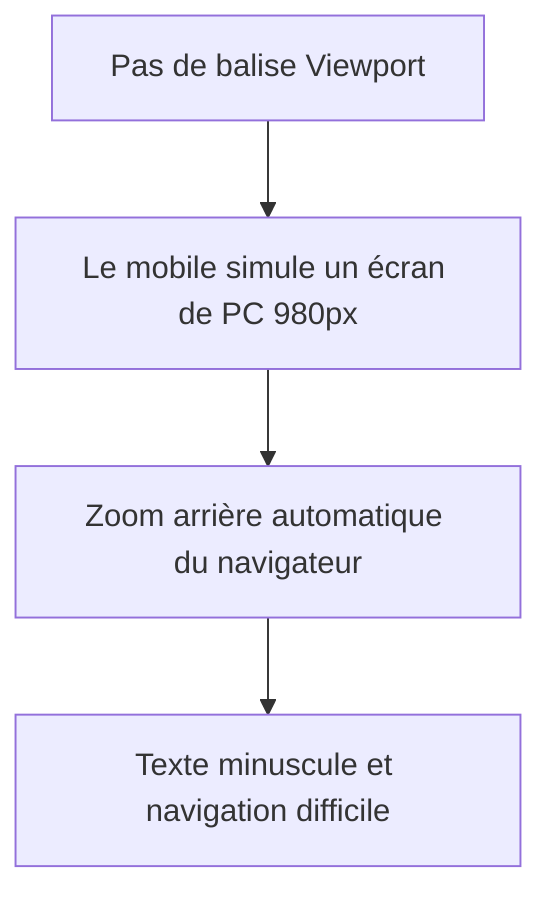

# La Balise Meta Viewport et le Responsive

La balise <meta> fait partie de la structure fondamentale d'un document HTML.

La balise `<meta name="viewport">` est indispensable pour créer des sites web adaptés aux mobiles (Responsive Web Design).

---

## 1. Le Concept : Le problème et la solution

### Le problème historique (Sans cette balise)

À l'apparition des premiers smartphones, les sites web étaient conçus uniquement pour les ordinateurs (largeur d'environ 980 pixels). 

Pour afficher ces sites sur des petits écrans (de 320 pixels), les navigateurs mobiles trichaient :
1. Ils simulaient un écran d'ordinateur de 980 pixels.
2. Ils chargeaient la page entière.
3. Ils effectuaient un zoom arrière global pour faire rentrer le site dans l'écran.

**Résultat :** Le texte devenait minuscule et illisible. L'utilisateur devait zoomer manuellement et scroller horizontalement.



### La solution : Configurer le Viewport

Le mot "viewport" désigne la zone d'affichage de la page web à l'écran. En ajoutant cette balise, vous donnez des instructions directes au navigateur du téléphone.

---

## 2. La Syntaxe Standard (Recommandée)

C'est la configuration à utiliser par défaut dans tous vos projets :

```html
<meta name="viewport" content="width=device-width, initial-scale=1.0">

```

### Explication des instructions :

* **`width=device-width`** : Indique au navigateur d'utiliser la véritable largeur de l'écran de l'appareil (en pixels CSS). Les règles CSS `@media (max-width: ...)` peuvent alors se déclencher correctement.
* **`initial-scale=1.0`** : Définit le zoom initial à 100%. Le site s'affiche immédiatement à sa taille normale.

| Sans la balise | Avec la balise |
| --- | --- |
| Le mobile simule un écran de PC. | Le mobile utilise sa vraie largeur. |
| Le site est affiché en miniature. | Le site s'adapte, le texte est lisible. |
| Zoom horizontal obligatoire. | Défilement uniquement de haut en bas. |

---

## 3. Les Options Avancées

La directive `content=""` accepte d'autres propriétés, séparées par des virgules, pour répondre à des besoins spécifiques.

### A. Le contrôle du zoom (Accessibilité)

Ces options modifient ou bloquent le zoom manuel avec deux doigts (*pinch-to-zoom*).

* **`minimum-scale`** : Seuil de dézoom maximum (ex: `0.5` pour zoomer en arrière jusqu'à la moitié).
* **`maximum-scale`** : Seuil de zoom maximum (ex: `3.0` pour zoomer jusqu'à 3 fois la taille).
* **`user-scalable`** : Autorise (`yes`) ou interdit (`no`) le zoom pour l'utilisateur.

⚠️ **Règle d'accessibilité stricte :** Bloquer le zoom avec `user-scalable=no` ou `maximum-scale=1.0` est fortement déconseillé. Cela empêche les personnes malvoyantes d'agrandir le texte. Les navigateurs modernes ignorent souvent ces restrictions pour protéger l'utilisateur.

### B. La gestion des encoches (`viewport-fit`)

Cette option gère l'affichage sur les écrans modernes dotés d'une encoche (*notch*) ou d'un îlot dynamique (ex: iPhones récents).

* **`viewport-fit=auto`** (par défaut) : Le site reste dans la zone rectangulaire sûre. Des bandes noires ou blanches apparaissent sur les côtés en mode paysage.
* **`viewport-fit=cover`** : Le site web occupe 100% de l'écran physique et passe sous l'encoche. Idéal pour les designs immersifs ou les jeux.

---

## 4. Synthèse des cas pratiques

Voici les trois configurations principales à retenir selon le projet :

### Cas 1 : Le standard pour tous les sites internet

```html
<meta name="viewport" content="width=device-width, initial-scale=1.0">

```

### Cas 2 : Pour une interface immersive ou un jeu web (Plein écran)

```html
<meta name="viewport" content="width=device-width, initial-scale=1.0, viewport-fit=cover">

```

### Cas 3 : Pour une application web fermée (Style application native)

```html
<meta name="viewport" content="width=device-width, initial-scale=1.0, maximum-scale=5.0">

```
