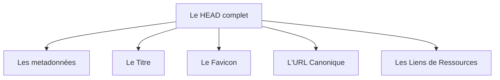

## L'entête d'un document HTML

L'en-tête `<head>` contient des balises . Pour créer un document valide et optimisé, il faut inclure ces éléments :



### La balise `<title>` (Le titre de l'onglet)

* **Pourquoi c'est crucial :** C'est l'élément le plus important pour le référencement (SEO) après le contenu de la page. C'est le titre bleu cliquable dans Google.
* **Bonne pratique :** Moins de 60 caractères, contenant le mot-clé principal de la page.

### Le Favicon (L'icône du site)

```html
<link rel="icon" type="image/png" href="./favicon.png">
```

* **Pourquoi c'est crucial :** C'est la petite image qui s'affiche à gauche du titre dans l'onglet du navigateur ou dans les favoris de l'utilisateur.

### L'URL Canonique (Éviter le contenu dupliqué)

```html
<link rel="canonical" href="https://mon-site.fr/produit-bleu">

```

* **Pourquoi c'est crucial :** Si un même produit est accessible via deux URL différentes (ex: avec des filtres de recherche), cette balise indique à Google quelle est l'adresse officielle à indexer pour éviter d'être pénalisé pour "plagiat" de son propre site.

### L'optimisation des performances (`preconnect` / `dns-prefetch`)

```html
<link rel="preconnect" href="https://fonts.googleapis.com">
```

* **Pourquoi c'est crucial :** Dit au navigateur de commencer à se connecter à un serveur externe (comme Google Fonts) avant même d'avoir lu les lignes de CSS. Cela gagne de précieuses millisecondes au chargement.


### Les métadonnées `<meta>`

Les métadonnées sont détaillées dans le support [HTML: Les métadonnées](./HTML-head-meta.md)


### Les ressources externes

Pour lier des fichiers externes, le `<head>` utilise principalement deux balises distinctes :

| Balise | Description
| --- | --- |
| `<link>` | établit un lien passif avec une ressource indispensable à la page, le plus souvent une feuille de style CSS (`rel="stylesheet"`) ou une icône (`rel="icon"`). Elle ne contient pas de code et est auto-fermante. |
| `<script>` | charge et exécute du code JavaScript actif. Contrairement à la balise `<link>`, elle nécessite obligatoirement une balise de fermeture complète (`</script>`). |

```html
<link rel="stylesheet" href="./chemin/vers/un/fichier.css">
<script src="/chemin/vers/un/script.js" defer></script>
```

> [!info] 
>
> **Règle de performance :** Pour éviter de bloquer l'affichage du HTML pendant le téléchargement d'un script lourd, utilisez toujours l'attribut `defer` (ex: `<script src="..." defer></script>`). Cela permet de charger le script en arrière-plan et de ne l'exécuter qu'une fois le code HTML entièrement lu par le navigateur.

---

## Synthèse de l'ordre idéal du `<head>`

Pour un code propre et performant, Structurez le `<head>` dans cet ordre précis :

1. Encodage (`charset`)
2. Affichage mobile (`viewport`)
3. Titre de la page (`title`)
4. Métadonnées SEO (`description`, `robots`)
5. Métadonnées Réseaux Sociaux (`og:`, `twitter:`)
6. Liens externes (`favicon`, `canonical`, CSS externes)