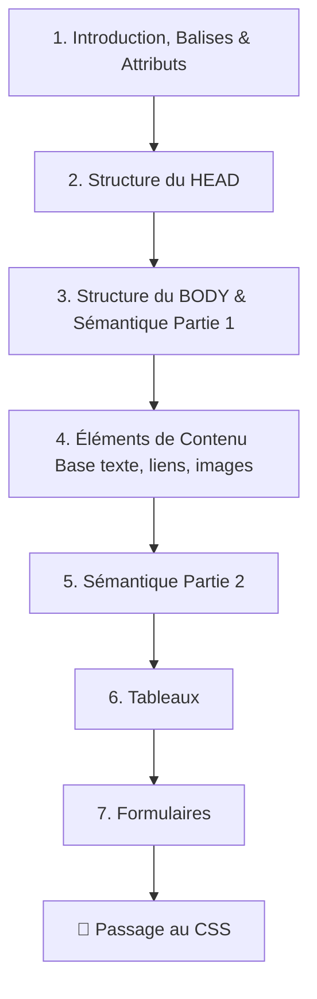
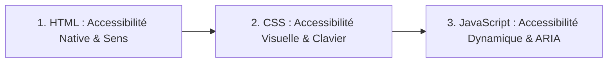

## Module CP03-FRONTEND : Intégration Statique et Normes du Web

> [!INFO]
>
> **REAC DWWM :** CP03 - Réaliser des interfaces utilisateur statiques web ou web mobile.
> **REAC CDA :** CP02 - Développer des interfaces utilisateur
> **Standards :** HTML5 sémantique, CSS3, Méthodologie BEM, Accéssibilité numérique.



# Structure de base d'un document HTML 

```html
<!DOCTYPE html>
<html lang="fr">
    <head>
        <!-- Les meta informations de la page viennent ici -->
    </head>
    <body>
        <!-- Le contenu de la page vient ici -->
    </body>
</html>
```

1. **Présentation générale**
    - [La petite histoire du web et du HTML](./html-00-presentation.md)
    - [La boîte à outils du développeur web frontend](./html-00-toolbox.md)
2. **Introduction au langage HTML**
    - [Le Système de Balises et d'Attributs](./html-01-intro-balises.md
    - [L'entête d'un document HTML (head)](./html-02-head.md)
    - [Configurer sa page : Les informations cachées au navigateur](./html-03-head-meta.md)
    - [Préparer son site pour les smartphones et les tablettes](./html-04-head-meta-viewport.md)

3. **Le contenu d'un document HTML**
    - [Le corps d'un document HTML (body)](./html-05-body.md)
    - [L'importance de la sémantique (partie 1)](./html-06-semantique.md)
    - [Les éléments de contenu de base (textes, liens, images)](./html-07-elements-base.md)
    - [L'importance de la sémantique (partie 2)](./html-08-semantique2.md)
    - [Les formulaires](./html-09-formulaires.md
    - [Les tableaux](./html-10-tableaux.md)

4. **Mettre en forme le contenu : Les feuilles de style**
    * **Niveau 1 & 2 : Mémoriser et Comprendre**
        * Balises & Structre HTML
        * Rôle de la sémantique HTML5 pour le référencement naturel (SEO) et l'accessibilité.
        * Compréhension de la cascade CSS, de la responsivité et du modèle de boîte.
    * **Niveau 3 & 4 : Appliquer et Analyser**
        * Intégration d'une maquette statique en utilisant HTML5 et CSS3 (Flexbox et Grid).
        * Application de la méthodologie BEM pour structurer les classes CSS.
        * Mise en place des mentions légales obligatoires liées au RGPD.
    * **Niveau 5 & 6 : Évaluer et Créer**
        * Validation du code produit via les outils de vérification officiels du W3C.
    * **Mini-projet :** 
        * Intégration complète d'un site vitrine multipage, entièrement accessible, éco-conçu et déployé de manière sécurisée.


## Accessibilité numérique 

L'accessibilité (A11y) ne doit pas être négligée, elle doit être intégrée **dès vos premières lignes de code HTML**, puis dans vos feuilles de styles...

L'accessibilité est une **responsabilité par étapes**.



---

## 1. Module HTML : L'accessibilité native

**C'est le moment le plus critique.** 80% de l'accessibilité web se résout avec un HTML propre et sémantique.

* **Ce qu'il faut intégrer immédiatement :**
    * L'attribut `alt` obligatoire sur les images.
    * Le choix des balises de sens (`<main>`, `<nav>`, `<article>`, `<h1>` à `<h6>`) plutôt que de tout mettre dans des `<div>`. Les lecteurs d'écran en ont besoin pour naviguer.
    * L'association stricte des balises `<label>` et `<input>` dans les formulaires via l'attribut `for`/`id`.
* **En résumé :** *"Faire du HTML sémantique, c'est automatiquement faire du web accessible."*

---

## 2. Module CSS : L'accessibilité visuelle et la navigation

Ici, on traite du confort visuel et de l'expérience utilisateur sans la souris.

* **Ce qu'il faut intégrer :**
    * **Le contraste des couleurs :** Apprendre à utiliser les DevTools (F12) pour vérifier si le texte est lisible (normes WCAG).
    * **La navigation au clavier :** Placer les tabindex, toujours conserver le `outline` (la bordure bleue ou noire) lors du focus sur les boutons et les liens avec la touche Tabulation.
    * **L'ordre visuel :** Veiller à ce que l'utilisation de Flexbox ou CSS Grid ne perturbe pas l'ordre logique de lecture du HTML.

---

## 3. Module JS : L'accessibilité dynamique

C'est l'étape la plus complexe à gérer : le code modifie la page en temps réel.

* **Ce qu'il faut intégrer :**
    * **La gestion du focus :** Quand une modale (fenêtre pop-up) s'ouvre, le clavier doit être "piégé" à l'intérieur pour qu'un utilisateur malvoyant ne se perde pas derrière l'écran.
    * **Les attributs ARIA :** Utiliser `aria-expanded="true/false"` pour indiquer en JavaScript si un menu accordéon est ouvert ou fermé.
    * **Les alertes dynamiques :** Utiliser `aria-live` pour que le lecteur d'écran annonce une erreur de formulaire apparue en JavaScript sans recharger la page.

---

## En résumé : Pourquoi ?

Intégrer l'accessibilité dès le début du HTML crée un réflexe métier naturel. C'est une habitude simple qui valorise votre travail tout au long du projet.

## Ressources 

[apprendre-html-et-css.com](https://www.apprendre-html-et-css.com/)

