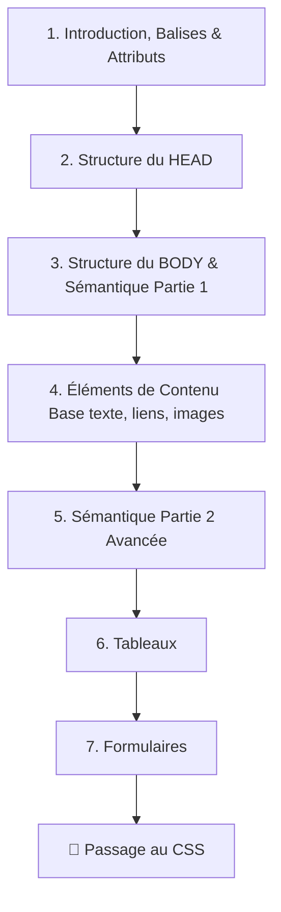

## Module CP03-FRONTEND : Intégration Statique et Normes du Web

REAC Visé : CP3 — Réaliser des interfaces utilisateur statiques web ou web mobile.
Standards : HTML5 sémantique, CSS3 (Flexbox, Grid), Méthodologie BEM.



# Structure de base d'un document HTML 

```html
<!DOCTYPE html>
<html lang="fr">
    <head>
        <!-- Les meta informations de la page viennent ici -->
    </head>
    <body>
        <!-- Le contenu de la page vient ici -->
    </body>
</html>
```

1. **Introduction au langage HTML**
    - [Le Système de Balises et d'Attributs](./HTML-intro-balises.md)
    - [L'entête d'un document HTML (head)](./HTML-head.md)
    - [Configurer sa page : Les informations cachées au navigateur](./HTML-head-meta.md)
    - [Préparer son site pour les smartphones et les tablettes](./HTML-head-meta-viewport.md)

2. **Le contenu d'un document HTML**
    - [Le corps d'un document HTML (body)](./HTML-body.md)
    - [L'importance de la sémantique (partie 1)](./HTMl-semantique.md)
    - [Les éléments de contenu de base (textes, liens, images)](./HTML-elements.md)
    - [L'importance de la sémantique (partie 2)](./HTML-semantique2.md)
    - [Les tableaux](./HTML-tableaux.md)
    - [Les formulaires](./HTML-formulaires.md)


* **Niveau 1 & 2 : Mémoriser et Comprendre**
    * Balises & Structre HTML
    * Rôle de la sémantique HTML5 pour le référencement naturel (SEO) et l'accessibilité.
    * Compréhension de la cascade CSS, de la responsivité et du modèle de boîte.
* **Niveau 3 & 4 : Appliquer et Analyser**
    * Intégration d'une maquette statique en utilisant HTML5 et CSS3 (Flexbox et Grid).
    * Application de la méthodologie BEM pour structurer les classes CSS.
    * Mise en place des mentions légales obligatoires liées au RGPD.
* **Niveau 5 & 6 : Évaluer et Créer**
    * Validation du code produit via les outils de vérification officiels du W3C.
* **Mini-projet :** 
    * Intégration complète d'un site vitrine multipage, entièrement accessible, éco-conçu et déployé de manière sécurisée.


## Ressources 

[apprendre-html-et-css.com](https://www.apprendre-html-et-css.com/)

