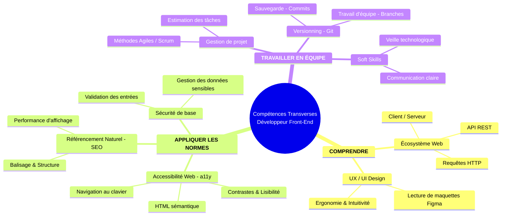

## Les compétences hors-code du Développeur Front-End

Pour réussir dans le métier, coder en HTML, CSS et JavaScript ne suffit pas. Un développeur travaille en équipe et doit comprendre tout ce qui entoure le projet Web.

---

---

### Comprendre le besoin et l'environnement

#### 1. L'Ecosystème du Web

Savoir comment Internet fonctionne sous le capot.

* **Client / Serveur :** Savoir ce que fait le navigateur (client) et ce que fait la base de données ou l'application (serveur).
* **Requêtes HTTP :** Comprendre les échanges entre le client et le serveur (ex: charger une page, envoyer un formulaire).
* **API REST :** Comprendre comment récupérer ou envoyer des données texte (souvent au format JSON).

#### 2. L'Expérience Utilisateur (UI / UX)

Savoir transformer une maquette en écran fonctionnel.

* **Wireframe et Maquette :** Savoir lire et analyser un plan créé sur un outil comme Figma.
* **Ergonomie :** Rendre l'interface intuitive pour l'utilisateur.

---

### Respecter les règles et normes du Web

#### 3. L'Accessibilité Web (a11y)

Rendre le site utilisable par tous, y compris les personnes en situation de handicap.

* **Navigation au clavier :** Permettre de tout faire sans la souris.
* **Lisibilité :** Garantir un bon contraste des couleurs et des tailles de texte adaptées.
* **Lecteurs d'écran :** Structurer le code avec du HTML sémantique pour les déficients visuels.

#### 4. Le Référencement Naturel (SEO)

Aider les moteurs de recherche (comme Google) à bien comprendre le site.

* **Balises importantes :** Bien utiliser les titres ($h1$, $h2$), les descriptions et les attributs d'images.
* **Performance :** Un site rapide est mieux classé par les moteurs de recherche.

#### 5. La Sécurité de base

Protéger les utilisateurs et les données.

* **Validation des formulaires :** Ne jamais faire confiance aux données saisies par l'utilisateur.
* **Mots de passe et données sensibles :** Savoir ce qui peut être affiché à l'écran et ce qui doit rester secret.

---

### Travailler dans une équipe projet

#### 6. La Gestion de Projet et l'Agilité

Organiser son travail au quotidien.

* **Méthodes Agiles (Scrum / Kanban) :** Travailler par petites étapes courtes (sprints) et mettre à jour un tableau de tâches (ex: Trello, Jira).
* **Estimation du temps :** Évaluer combien de temps prend une tâche simple.

#### 7. Le Versionning (Git)

Garder l'historique de son code et travailler à plusieurs sur le même projet.

* **Commandes de base :** Sauvegarder son travail localement (`commit`) et le partager (`push`).
* **Branches :** Travailler sur une nouvelle fonctionnalité sans bloquer le travail des autres.

#### 8. La Communication et la Veille

Développer ses compétences humaines (Soft Skills).

* **Communication claire :** Expliquer un blocage à son équipe ou poser une question précise.
* **Veille technologique :** Apprendre à s'informer régulièrement pour suivre l'évolution des technologies Web.

---