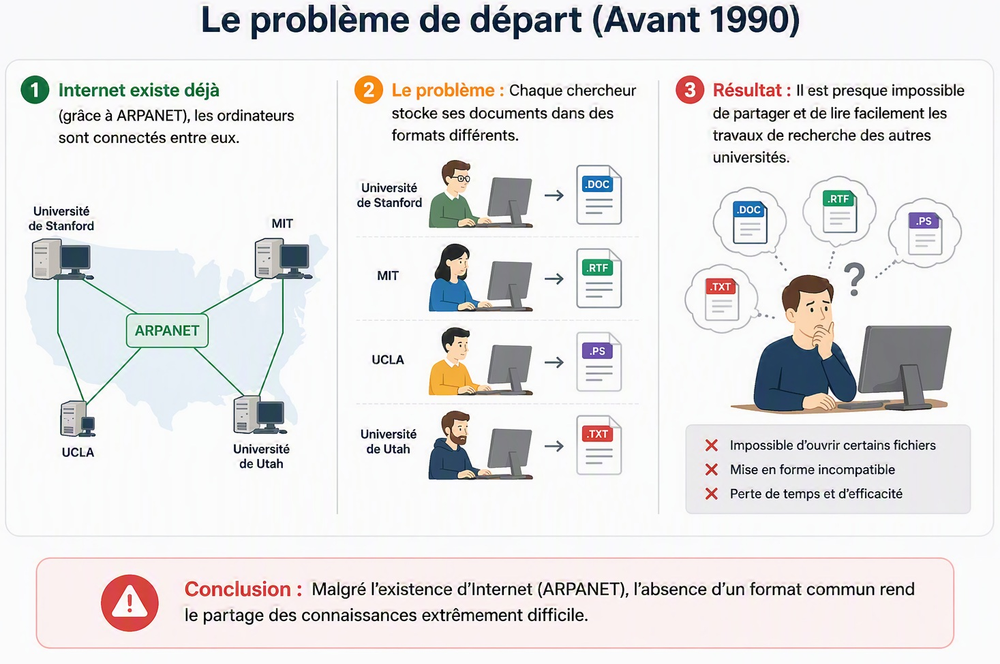
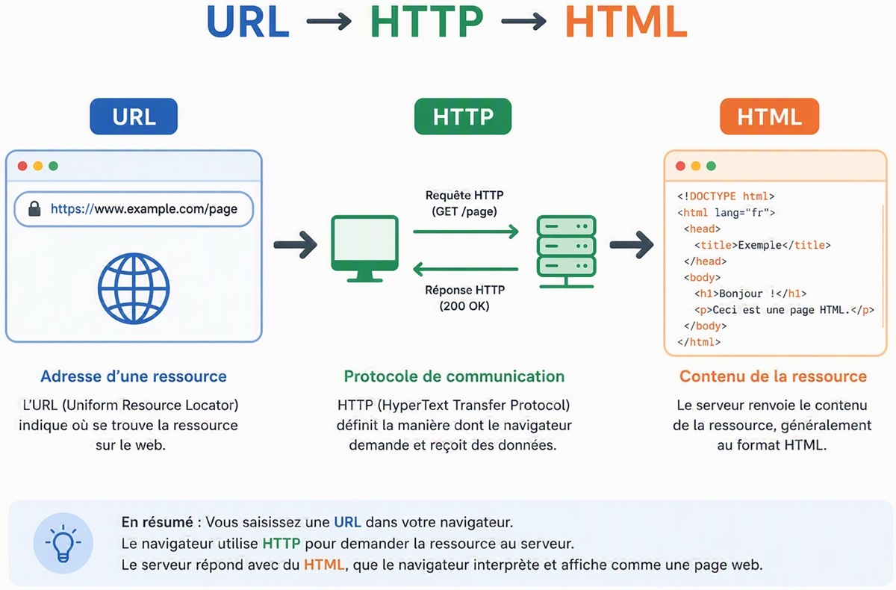
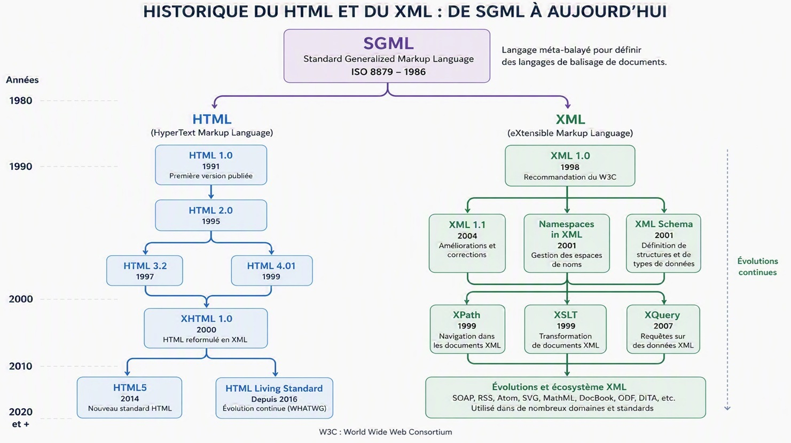
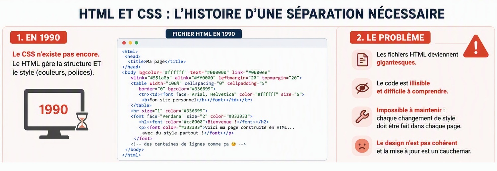
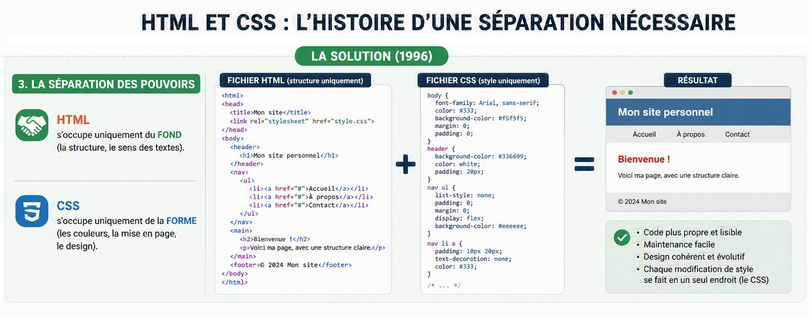

# L'Histoire du Web : D'où vient le HTML ?

## Comprendre le sens derrière le code

> #### Objectifs pédagogiques
>
> * **Identifier** les 3 piliers fondateurs du Web (URL, HTTP, HTML) et leur rôle respectif.
> * **Différencier** le rôle du HTML (fond / structure) et du CSS (forme / design).
> * **Distinguer** les caractéristiques du HTML par rapport au XML.

---

---

## 2. La solution : Le Web (1989 - 1990)

**Tim Berners-Lee** crée **3 technologies indissociables** :

* **HTML** : Le langage de balisage pour **structurer** et lire le document.
* **HTTP** : Le protocole de communication pour **transporter** le document.
* **URL** : L'adresse unique pour **trouver** un document.

---

---

---

## 4. HTML et XML : Deux cousins germains

**HTML** et **XML** partagent le même ancêtre (SGML). 
Même système de balises, objectifs différents.

| Caractéristique | HTML 🌐 | XML 📄 |
| --- | --- | --- |
| **Objectif** | **Afficher** et structurer une page web. | **Transporter** et stocker de la donnée. |
| **Balises** | **Figées** (`<h1>`, `
`, `<a>`). On doit utiliser les balises officielles. | **Libres** (`<prix>`, `<boisson>`). Le développeur invente ses balises. |
| **Tolérance** | **Souple**. Le navigateur essaie d'afficher même s'il y a une erreur. | **Strict**. La moindre erreur bloque tout. |

---

## Ce qu'il faut retenir

* Le HTML a été créé pour **structurer et lier des documents** entre eux via des liens hypertextes.
* On utilise des **balises officielles** (contrairement au XML) pour que tous les navigateurs du monde comprennent la même structure.
* Le **HTML** n'est que la structure : il a besoin d'une **URL** pour être trouvé et du **HTTP** pour voyager.

---

## 4. Et le CSS dans tout ça ?

---

## 4. Et le CSS dans tout ça ?

---

## 5. Votre boîte à outils

Pour créer vos pages web, vous allez utiliser 3 outils :

1. **Le Rédacteur (VS Code) :** Pour écrire votre code.
2. **Le Traducteur (Le Navigateur) :** Pour lire votre fichier et afficher le résultat à l'écran.
3. **Le Juge Arbitre (Le Validateur W3C) :** Le site officiel qui vérifie si votre code respecte les règles internationales.

--- 

🚀 **Place à la pratique : Ouvrons VS Code !**