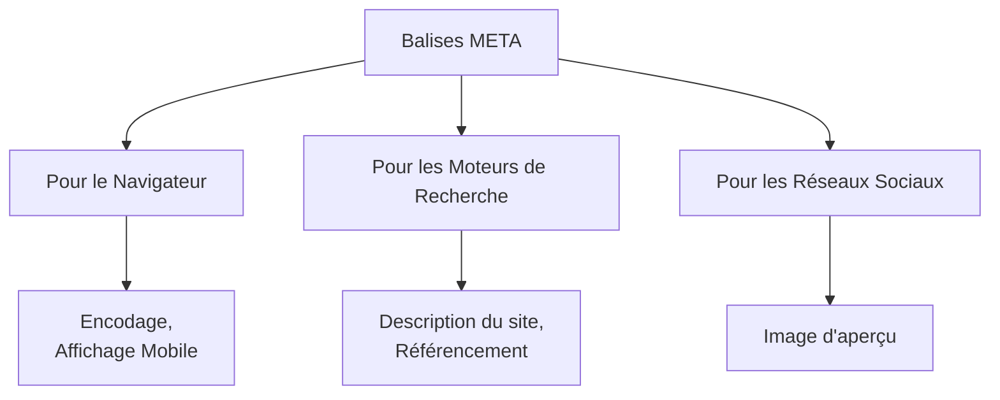
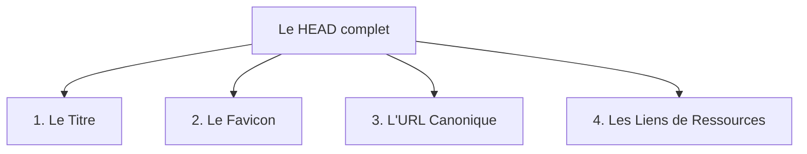

# Les Balises Meta en HTML

> [!NOTE] 
> 
> #### Objectifs pédagogiques
>
> - **Comprendre** l'utilité des métadonnées dans un document HTML
> - **Définir** les métadonnées pour le navigateur
> - **Définir** les métadonnées pour les moteurs de recherche
> - **Définir** les métadonnées pour les réseaux sociaux
> 

Une balise `<meta>` sert à insérer des **métadonnées** dans un document HTML.

L'utilisateur ne voit pas ces informations sur le site.

Ces informations sont cruciales pour :

* Les navigateurs web.
* Les moteurs de recherche.
* Les réseaux sociaux.



---

Toutes les balises `<meta>` se placent obligatoirement dans l'en-tête du document, entre `<head>` et `</head>`.

```html
<html lang="fr">
    <head>
        <meta charset="utf-8">
        <meta ...>
        <meta ...>
        <!-- etc... -->
    </head>
    <body>
        [...]
    </body>
</html>
```

## Les balises indispensables

Voici les balises meta obligatoires dans tout projet web moderne.

### Configuration technique pour le navigateur


```html
<meta charset="utf-8">
```

* **Rôle :** Permet d'afficher correctement les accents (é, à, ç) et tous les alphabets.
* **Règle :** À placer obligatoirement en première ligne dans le `<head>`.

```html
<meta name="viewport" content="width=device-width, initial-scale=1.0">
```

* **Rôle :** Active le mode mobile (Responsive Web Design). Obligatoire pour que le site s'adapte à la taille de l'écran.


```html
<meta name="theme-color" content="#317EFB">
```

* **Rôle :** Change la couleur de la barre de navigation du navigateur (sur Chrome Android ou Safari iOS) pour l'accorder aux couleurs de votre site.
* **Intérêt :** Donne un aspect "application native" très qualitatif.


```html
<meta http-equiv="refresh" content="5;url=https://mon-site.fr/accueil">
```

* **Rôle :** Redirige automatiquement l'utilisateur vers une autre page après un nombre de secondes défini (ici, 5 secondes).

> [!WARNING]
>
> **Alerte Accessibilité :** Utilisez `meta http-equiv="refresh"` avec une *extrême prudence* car cela perturbe les lecteurs d'écran pour les personnes en situation de handicap.

---

### Configuration pour le référencement (SEO)

```html
<meta name="description" content="Une description de la page web courante.">
```

* **Rôle :** Affiche un résumé du site dans les résultats de recherche (Google, Bing etc...).
* **Taille idéale :** Entre 150 et 160 caractères maximum.

```html
<meta name="robots" content="index, follow">
```

* **Rôle :** Donne des instructions aux robots des moteurs de recherche.
* `index` : autorise à afficher la page dans les résultats.
* `follow` : autorise à suivre les liens de la page pour découvrir d'autres pages.
* *Alternative :* `noindex, nofollow` (pour masquer une page privée ou en cours de développement).

--- 


## Le `<head>` ne contient pas que des meta

L'en-tête `<head>` ne contient pas que des balises `<meta>`. Pour créer un document valide et optimisé, il faut inclure ces quatre autres éléments :



### 1. La balise `<title>` (Le titre de l'onglet)

* **Pourquoi c'est crucial :** C'est l'élément le plus important pour le référencement (SEO) après le contenu de la page. C'est le titre bleu cliquable dans Google.
* **Bonne pratique :** Moins de 60 caractères, contenant le mot-clé principal de la page.

### 2. Le Favicon (L'icône du site)

```html
<link rel="icon" type="image/png" href="./favicon.png">

```

* **Pourquoi c'est crucial :** C'est la petite image qui s'affiche à gauche du titre dans l'onglet du navigateur ou dans les favoris de l'utilisateur.

### 3. L'URL Canonique (Éviter le contenu dupliqué)

```html
<link rel="canonical" href="https://mon-site.fr/produit-bleu">

```

* **Pourquoi c'est crucial :** Si un même produit est accessible via deux URL différentes (ex: avec des filtres de recherche), cette balise indique à Google quelle est l'adresse *officielle* à indexer pour éviter d'être pénalisé pour "plagiat" de son propre site. (En savoir plus sur le [duplicate content](https://www.google.com/search?q=duplicate+content))

### 4. L'optimisation des performances (`preconnect` / `dns-prefetch`)

```html
<link rel="preconnect" href="https://fonts.googleapis.com">

```

* **Pourquoi c'est crucial :** Dit au navigateur de commencer à se connecter à un serveur externe (comme Google Fonts) avant même d'avoir lu les lignes de CSS. Cela gagne de précieuses millisecondes au chargement.

---

## 3. Synthèse de l'ordre idéal du `<head>` (Niveau 5 - Bloom)

Pour un code propre et performant, apprenez à vos groupes à toujours structurer le `<head>` dans cet ordre précis :

1. Encodage (`charset`)
2. Affichage mobile (`viewport`)
3. Titre de la page (`title`)
4. Métadonnées SEO (`description`, `robots`)
5. Métadonnées Réseaux Sociaux (`og:`, `twitter:`)
6. Liens externes (`favicon`, `canonical`, CSS externes)

Souhaitez-vous que nous rédigions le script d'un exercice pratique de validation (de type "Trouvez les erreurs dans ce `<head>`") pour tester les connaissances de vos apprenants ?


--- 


## 3. Les balises obsolètes (À ne plus utiliser)

Le web évolue. Certaines balises autrefois indispensables sont aujourd'hui inutiles ou ignorées par les technologies modernes.

### ❌ Les mots-clés (`keywords`)

```html
<meta name="keywords" content="code, html, css">
```

**Pourquoi ?** Google et les autres grands moteurs de recherche ignorent totalement cette balise depuis plus de 10 ans. Elle ne sert plus à rien.


### ❌ La compatibilité Internet Explorer (`X-UA-Compatible`)

```html
<meta http-equiv="X-UA-Compatible" content="IE=edge">
```
**Pourquoi ?** Cette meta servait à forcer les anciennes versions d'Internet Explorer à utiliser le moteur de rendu le plus récent. Internet Explorer est officiellement abandonné. Les navigateurs modernes n'en ont plus besoin.

--- 

## 4.  Résumé des bonnes pratiques 

| Règle d'or | Pourquoi ? | 
| --- | --- | 
| **L'ordre du code** | La balise `charset` doit toujours être écrite en premier. | 
| **L'unicité** | Chaque page de votre site doit avoir une `description` différente. | 
| **La simplicité** | Ne pas écrire de balises inutiles pour garder un code propre. | 


## 5. Pour aller plus loin : Le partage social 

Lorsque vous partagez un lien sur un réseau social, une carte visuelle s'affiche automatiquement. 

les réseaux sociaux lisent deux principaux types de balises `meta` : 

**Open Graph (og:) :** Créé à l'origine par Facebook, c'est aujourd'hui le standard universel. Il est utilisé par la majorité des réseaux sociaux.

**Twitter Cards (twitter:) :** Développé par Twitter (X). Si ces balises sont absentes, la plateforme utilise automatiquement les balises Open Graph en remplacement.

### Les meta "sociales"

**Le Standard Universel (Open Graph)**

```html
<meta property="og:title" content="Titre clair et accrocheur">
<meta property="og:description" content="Résumé textuel de la page (environ 150 caractères).">
<meta property="og:image" content="https://mon-site.fr/images/apercu.jpg">
<meta property="og:url" content="https://mon-site.fr/ma-page.html">
<meta property="og:type" content="website">
```

**Le Standard Spécifique pour X / Twitter**

```html
<meta name="twitter:card" content="summary_large_image">
<meta name="twitter:title" content="Titre clair et accrocheur">
<meta name="twitter:description" content="Résumé textuel de la page.">
<meta name="twitter:image" content="https://mon-site.fr/images/apercu.jpg">
```

**Note pour `twitter:card` :** La valeur `summary_large_image` permet d'afficher l'image en grand au-dessus du texte, ce qui génère plus de clics.

---

### Synthèse des bonnes pratiques 

| Règle d'or | Impact | 
| --- | --- | 
| **URL Absolues** | L'image de l'attribut `og:image` doit obligatoirement posséder un chemin absolu (avec `https://...`) pour que les serveurs externes puissent la télécharger. | 
| **Format des images** | Utiliser de préférence le format JPG ou PNG, avec une dimension recommandée de 1200 x 630 pixels pour un affichage net sur tous les écrans. | 
| **Outils de test** | Toujours tester son code avant publication avec les outils officiels gratuits (comme le *Facebook Sharing Debugger* ou le *LinkedIn Post Inspector*). | 

