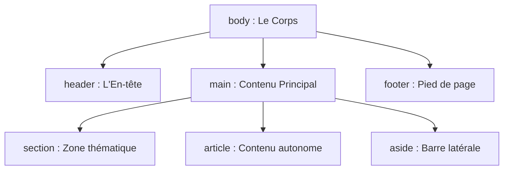
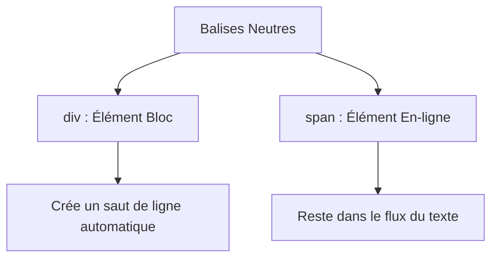

# Le Corps d'un Document HTML 

## La Balise `<body>`

Après avoir configuré l'en-tête (`<head>`), le corps (`<body>`) constitue la partie visible de votre page web. Tout ce que vous écrivez à l'intérieur de la balise `<body>` sera affiché à l'écran pour l'utilisateur.

> [!NOTE] 
> 
> #### Objectifs pédagogiques
>
> - **Structurer** un document HTML
> - **Organiser** les zones de 1er niveau d'un document HTML
> - **Structurer** le contenu principal d'un document HTML
> - **Utiliser** des balises HTML sémantiques adaptées au contenu


## L'élément `<body>`

La balise `<body>` est unique. Elle sert de conteneur global pour tous les éléments visuels d'une page : textes, images, boutons, formulaires ou vidéos.

Pour créer un site moderne, accessible et bien référencé (SEO), on utilise des **balises sémantiques**. Ces balises structurent le document en donnant du sens au contenu, comme les pièces d'une maison.



## La structure de base

Principales zones à utiliser pour organiser le contenu à l'intérieur du `<body>`.

### Les zones structurelles de premier niveau

* **`<header>`** : L'en-tête de la page. Il contient généralement le logo du site, le titre principal et le menu de navigation.
  * 
* **`<nav>`** : La zone de navigation. Elle regroupe les liens principaux permettant de changer de page.
  * On l'utilise 
* **`<main>`** : Le cœur de la page. Il englobe le contenu unique et principal du document. 
* **`<footer>`** : Le pied de page. Il contient les mentions légales, les liens de contact ou les droits d'auteur.

> [!info]
> Il ne peut y avoir qu'un seul `<main>` visible par page.
> La balise `<nav>` est utilisée pour pour le menu principal, le fil d'arianne, les menus secondaires...


**Exemple :**

```html
<body>
  <header>
    <h1>Mon Site</h1>
    <nav></nav>
  </header>
  <main></main>
  <footer></footer>
</body>
```

<div style="page-break-after:always;"></div>

## Structurer le contenu dans `<main>`

À l'intérieur de la zone principale (`<main>`), le texte et les éléments doivent suivre une hiérarchie stricte.

### A. La hiérarchie des titres (`<h1>` à `<h6>`)

Les titres structurent la lecture pour l'utilisateur et pour les robots des moteurs de recherche.

* **`<h1>`** : Le titre principal du sujet de la page. 
  - **Règle absolue :** Un seul `<h1>` par page.
  - **Règle de référencement :** Chaque page possède un titre `<h1>` différent
* **`<h2>`** : Les sous-titres des grandes sections.
* **`<h3>`** : Les sous-sections, et ainsi de suite jusqu'à `<h6>`.

> [!WARNING]
> 
> **Erreur classique :** Ne choisissez jamais une balise de titre pour sa taille. On utilise le HTML pour le sens (la structure), et le CSS pour le style (la taille, la couleur).

### B. Les blocs de contenu

| Balise | Description |
| --- | --- |
| **`<section>`** | Regroupe des contenus qui partagent une même thématique (ex: une section "Témoignages", une section "Tarifs"). Chaque section doit idéalement commencer par un titre (`<h2>`). |
| **`<article>`** | Un contenu autonome qui pourrait être extrait du site et partagé ailleurs sans perdre son sens (ex: un article de blog, une fiche produit). |
| **`<aside>`** | **`<p>`** : Un paragraphe de texte simple. |

> [!info]
>
> Les `<section>` et les `<article>` peuvent contenir un `<header>` et un `<footer>`.

<div style="page-break-after:always;"></div>

### B.1 Tableau de validation sémantique

| Mauvaise pratique (Non sémantique) | Bonne pratique (Sémantique) | Impact |
| --- | --- | --- |
| `<div class="menu">` | `<nav>` | Les lecteurs d'écran pour personnes malvoyantes identifient immédiatement la zone de navigation. |
| `<span class="gros-titre">` | `<h1>` | Sujet principal de la page (améliore le référencement). |
| `<div class="bas-de-page">` | `<footer>` | Le code est standardisé, plus propre et plus facile à maintenir en équipe. |


<div style="page-break-after:always;"></div>

## Utiliser `<div>` et `<span>` : Les règles de l'art

Lorsque les balises sémantiques (comme `<main>` ou `<nav>`) ne conviennent pas, HTML met à disposition deux balises neutres, sans aucun sens sémantique : `<div>` et `<span>`. Elles servent uniquement de points d'ancrage pour le CSS ou le JavaScript.



| Balise | Type | Description |
| --- | --- | --- |
| `<div>` | Block | Elle s'utilise pour regrouper un grand bloc d'éléments (par exemple, pour créer une grille ou une mise en page en colonnes avec CSS). Elle crée automatiquement un retour à la ligne avant et après elle. |  
| `<span>` | Inline | Elle s'utilise à l'intérieur d'un bloc, directement au milieu d'un texte, pour cibler un ou plusieurs mots précis (par exemple, pour mettre un mot en couleur). Elle ne crée aucun retour à la ligne. |


❌ **Mauvaise pratique :** Utiliser des `<div>` ou des `<span>` partout (la "divite"). Un document HTML rempli de `<div class="titre">` ou `<div class="bouton">` rend le site illisible pour les moteurs de recherche et inaccessible pour les personnes en situation de handicap.

✅ **Bonne pratique :** Utilisez ces balises en dernier recours, uniquement lorsque aucune balise sémantique ne correspond à votre besoin, et principalement pour des raisons de décoration ou de mise en page CSS.

[](https://html5doctor.com/downloads/h5d-sectioning-flowchart.pdf)  


## Ressources  
- [Index des éléments HTML](https://html5doctor.com/element-index/)
- [Choisir la bonne balise selon le contexte](https://html5doctor.com/resources/#flowchart)