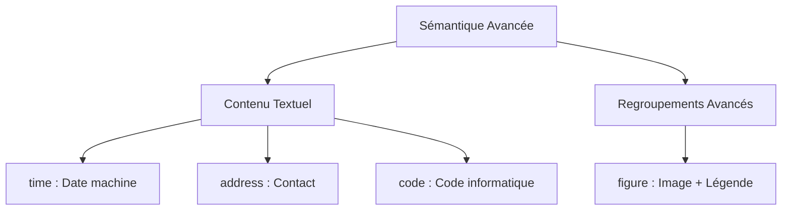

# La Sémantique HTML — Partie 2 : Aller plus loin (Expert)

Après avoir maîtrisé les grandes zones de mise en page (`<header>`, `<main>`, `<footer>`), devenir un développeur professionnel demande de savoir structurer le **micro-contenu**.

Cette partie 2 détaille les balises sémantiques avancées qui feront la différence en entreprise (code propre, accessibilité parfaite et SEO de précision).

---

## La sémantique du texte textuel 

Il existe des balises très précises pour entourer des portions de texte spécifiques. Elles indiquent aux navigateurs et aux liseuses de quoi on parle exactement.



* **`<time>`** : Indique une date ou une heure. C'est l'une des balises préférées de Google pour dater vos articles de blog.
* **`<address>`** : Regroupe les informations de contact de l'auteur ou de l'entreprise (adresse physique, lien vers un formulaire de contact, email).
* **`<code>`** : Indique qu'un texte est un morceau de code informatique.

<div style="page-break-after:always;"></div>

## Appliquer : Le format Date-Machine et les Figures 

### A. La balise `<time>` et l'attribut `datetime`

Le texte écrit entre `<time>` et `</time>` est ce que l'humain lit. L'attribut `datetime` est ce que la machine (le robot Google) lit.

```html
<p>L'exercice a été publié <time datetime="2026-06-28">Hier</time>.</p>

<p>La réunion commence à <time datetime="14:30">14h30</time>.</p>

```

### B. Associer une image et sa légende avec `<figure>` et `<figcaption>`

Pour lier sémantiquement une illustration (image, schéma, tableau) à sa légende, on arrête d'utiliser des paragraphes classiques.

```html
<figure>
  
  <figcaption>Figure 1 : Diagramme d'état du projet Distributeur</figcaption>
</figure>

```

<div style="page-break-after:always;"></div>

## Analyser : Les listes de description `<dl>` 

Au-delà des listes à puces classiques (`<ul>`, `<ol>`), HTML propose la liste de description. Elle est idéale pour créer des **FAQ (Foires Aux Questions)**, des glossaires ou des fiches techniques (Clé $\rightarrow$ Valeur).

* **`<dl>`** : Conteneur global (Description List).
* **`<dt>`** : Le terme à définir (Description Term).
* **`<dd>`** : La description ou la définition du terme (Description Details).

```html
<dl>
  <dt>A11y</dt>
  <dd>Numéronyme qui désigne l'accessibilité dans le monde du web.</dd>
  
  <dt>SEO</dt>
  <dd>Sigle pour Search Engine Optimization (Référencement Naturel).</dd>
</dl>

```

<div style="page-break-after:always;"></div>

## Tableau d'Impact Métier 

| Balise Avancée | Ce qu'elle remplace (À éviter ❌) | Gain concret en entreprise |
| --- | --- | --- |
| **`<time>`** | `<span class="date">` | Google peut afficher la date de publication directement dans ses résultats de recherche (*Rich Snippets*). |
| **`<figure>`** | `<div class="image-box">` | Les lecteurs d'écran lisent la légende directement après l'image, sans confusion pour l'utilisateur. |
| **`<dl>`** | Des successions de `<h3>` et de `<p>` | Structure le contenu sous forme de base de données (Clé/Valeur) nativement compréhensible par l'IA et les moteurs de recherche. |
