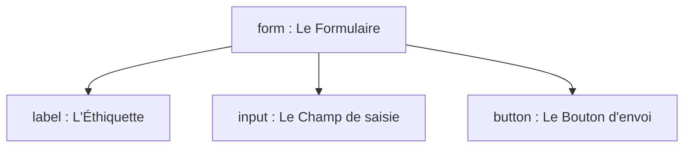

# Les Formulaires en HTML (Interactivité et Saisie)

Un formulaire permet à l'utilisateur de saisir des données (texte, choix, fichiers) et de les envoyer vers un serveur pour qu'elles soient traitées.

---

## 1. Les trois éléments clés d'un formulaire

Pour qu'un formulaire fonctionne et soit accessible, il repose sur l'association stricte de trois éléments fondamentaux.



* **`<form>`** : Le conteneur global du formulaire. Il définit où et comment envoyer les données grâce à ses attributs.
* **`<label>`** : L'étiquette textuelle qui explique à l'utilisateur ce qu'il doit saisir.
* **`<input>`** : Le champ de saisie où l'utilisateur tape ou sélectionne une information.

---

## 2. Créer un Formulaire Simple

Voici le code pour un formulaire de connexion classique.

```html
<form action="./connexion.php" method="POST">

  <p>
    <label for="identifiant">Nom d'utilisateur :</label>
    <input type="text" id="identifiant" name="username" required>
  </p>

  <p>
    <label for="mot-de-passe">Mot de passe :</label>
    <input type="password" id="mot-de-passe" name="password" required>
  </p>

  <button type="submit">Se connecter</button>

</form>

```
**Résultat :**

<div style="border: 1px solid black; padding: 10px;">
  <p>
    <label for="identifiant">Nom d'utilisateur :</label>
    <input type="text" id="identifiant" name="username" required>
  </p>

  <p>
    <label for="mot-de-passe">Mot de passe :</label>
    <input type="password" id="mot-de-passe" name="password" required>
  </p>

  <button type="submit">Se connecter</button>
</div>

---

## 3. Les Attributs Cruciaux

Les formulaires HTML s'appuient sur des attributs précis. Si l'un d'eux est oublié, le formulaire devient inutile ou inaccessible.

### A. Les attributs du conteneur `<form>`

* **`action`** : Indique l'adresse (URL ou script de destination) où les données doivent être envoyées (ex: `./traitement.php`).
* **`method`** : Définit comment les données voyagent.
* `GET` : Les données sont visibles directement dans l'adresse URL (utilisé pour des recherches).
* `POST` : Les données sont cachées dans le corps de la requête (obligatoire pour les mots de passe et les données sensibles).


### B. Le lien Label-Input (Règle d'Accessibilité TSA/TDAH/Malvoyance)

Pour lier un texte explicatif à son champ, l'attribut **`for`** du `<label>` doit être **strictement identique** à l'attribut **`id`** de l'`<input>`.

> **Pourquoi ?** Cela permet à un utilisateur de cliquer sur le texte pour activer le champ de saisie. Cela agrandit la zone cible, ce qui améliore le confort visuel et moteur.

### C. L'attribut indispensable pour le développeur backend : `name`

L'attribut **`name`** est l'identifiant de la donnée pour le serveur. Sans l'attribut `name`, la donnée saisie par l'utilisateur n'est tout simplement jamais envoyée au script PHP ou JavaScript.

---

## 4. Les Types d'Inputs courants

<a href="#md-forms-type" id="md-form-types">Le comportement</a>  de la balise orpheline `<input>` change complètement selon la valeur de son attribut `type`.

| Type d'Input | Code HTML | Rendu / Comportement |
| --- | --- | --- |
| **Texte standard** | `type="text"` | Un champ classique pour du texte libre (ex: un nom). |
| **Mot de passe** | `type="password"` | Masque automatiquement les caractères tapés par des puces. |
| **Email** | `type="email"` | Le navigateur vérifie automatiquement la présence d'un `@` et d'un point. |
| **Number** | `type="number"` | Le champ n'accepte que les données numériques. |
| **Case à cocher** | `type="checkbox"` | Permet de cocher ou décocher une option (ex: "Accepter les conditions"). |
| **Bouton Radio** | `type="radio"` | Permet un choix unique parmi plusieurs options portant le même `name`. |


---

### 1. Les types de texte de base

| Valeur de `type` | Code HTML | Comportement (Méthode FALC) |
| --- | --- | --- |
| **`text`** | `type="text"` | **Par défaut.** Un champ simple pour écrire une ligne de texte (ex: un prénom). |
| **`password`** | `type="password"` | Masque les caractères tapés par des points ou des étoiles pour la sécurité. |
| **`email`** | `type="email"` | Vérifie automatiquement si le texte contient un `@` et un point avant l'envoi. |
| **`url`** | `type="url"` | Vérifie automatiquement si le texte commence bien par un protocole web (`http://` ou `https://`). |
| **`search`** | `type="search"` | Identique au type text, mais ajoute souvent une petite croix à droite pour effacer le texte d'un clic. |
| **`tel`** | `type="tel"` | Dédié aux numéros de téléphone. Sur mobile, il ouvre automatiquement le pavé numérique. |

---

### 2. Les types numériques et curseurs

| Valeur de `type` | Code HTML | Comportement (Méthode FALC) |
| --- | --- | --- |
| **`number`** | `type="number"` | Autorise uniquement les chiffres. Ajoute des petites flèches pour monter ou descendre la valeur. |
| **`range`** | `type="range"` | Affiche un curseur horizontal à glisser vers la gauche ou la droite (utile pour un volume ou une jauge). |

---

### 3. Les types de sélection et de choix

| Valeur de `type` | Code HTML | Comportement (Méthode FALC) |
| --- | --- | --- |
| **`checkbox`** | `type="checkbox"` | Une case à cocher. L'utilisateur peut cocher plusieurs cases dans une liste. |
| **`radio`** | `type="radio"` | Un bouton d'option rond. Si plusieurs boutons ont le même attribut `name`, l'utilisateur peut en cocher **un seul** à la fois. |
| **`color`** | `type="color"` | Ouvre la palette de couleurs native de l'ordinateur ou du téléphone pour choisir une couleur. |

---

### 4. Les types de dates et d'heures

| Valeur de `type` | Code HTML | Comportement (Méthode FALC) |
| --- | --- | --- |
| **`date`** | `type="date"` | Ouvre un calendrier natif pour choisir un jour, un mois et une année. |
| **`time`** | `type="time"` | Ouvre une interface pour choisir une heure et des minutes (format HH:MM). |
| **`datetime-local`** | `type="datetime-local"` | Combine le calendrier et l'heure dans un seul et même champ. |
| **`month`** | `type="month"` | Permet de choisir un mois et une année spécifique (sans le jour). |
| **`week`** | `type="week"` | Permet de sélectionner une semaine complète de l'année (ex: Semaine 26). |

---

### 5. Les types d'action et techniques

| Valeur de `type` | Code HTML | Comportement (Méthode FALC) |
| --- | --- | --- |
| **`submit`** | `type="submit"` | Crée un bouton qui valide et envoie toutes les données du formulaire vers le serveur. *(Note: On lui préfère souvent la balise `<button type="submit"` plus flexible)*. |
| **`button`** | `type="button"` | Un bouton neutre qui ne fait rien par défaut. On l'utilise pour y attacher un script JavaScript plus tard. |
| **`reset`** | `type="reset"` | Un bouton qui efface instantanément toutes les saisies de l'utilisateur pour remettre le formulaire à zéro. |
| **`file`** | `type="file"` | Ouvre l'explorateur de fichiers pour permettre à l'utilisateur d'envoyer un document ou une image (ex: un CV PDF). |
| **`image`** | `type="image" src="..."` | Transforme une image en bouton de validation de formulaire. Nécessite l'attribut `src`. |
| **`hidden`** | `type="hidden"` | **Invisible à l'écran.** Permet au développeur de stocker une donnée technique (comme un identifiant) que l'utilisateur ne doit pas voir ni modifier, mais qui sera envoyée au serveur. |