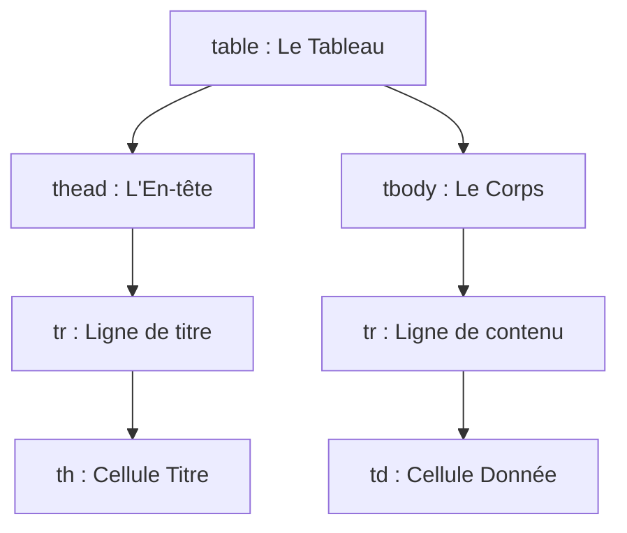

# Cours : Les Tableaux en HTML (Données structurées)

En développement web moderne, les tableaux ne doivent **jamais** être utilisés pour organiser la mise en page d'un site. Ils servent uniquement à afficher des **données tabulaires**, comme dans un tableur (Excel ou Google Sheets).

---

## La Structure Sémantique

Un tableau HTML se construit ligne par ligne. Pour qu'il soit accessible et bien structuré, on sépare l'en-tête du tableau de son corps.



### Les 5 balises fondamentales :

* **`<table>`** : Le conteneur principal du tableau.
* **`<thead>`** : Le groupe de lignes qui forme l'en-tête (les titres des colonnes).
* **`<tbody>`** : Le groupe de lignes qui contient les données réelles.
* **`<tr>`** (*Table Row*) : Représente une **ligne** du tableau.
* **`<th>`** (*Table Header*) : Une cellule de **titre** (le texte est en gras et centré par défaut).
* **`<td>`** (*Table Data*) : Une cellule de **donnée** standard.

<div style="page-break-after:always;"></div>

## Créer un Tableau Simple

Voici le code pour afficher un tableau de suivi des scores de notre projet pédagogique :

```html
<table>
  <thead>
    <tr>
      <th>Étudiant</th>
      <th>Projet</th>
      <th>Points</th>
    </tr>
  </thead>
  <tbody>
    <tr>
      <td>Thomas</td>
      <td>Password Hunter</td>
      <td>85</td>
    </tr>
    <tr>
      <td>Chloé</td>
      <td>Budget-Zen</td>
      <td>92</td>
    </tr>
  </tbody>
</table>
```

**Résultat :**

<table>
  <thead>
    <tr>
      <th>Étudiant</th>
      <th>Projet</th>
      <th>Points</th>
    </tr>
  </thead>
  <tbody>
    <tr>
      <td>Thomas</td>
      <td>Password Hunter</td>
      <td>85</td>
    </tr>
    <tr>
      <td>Chloé</td>
      <td>Budget-Zen</td>
      <td>92</td>
    </tr>
  </tbody>
</table>

<div style="page-break-after:always;"></div>

## Fusionner des Lignes et des Colonnes

Parfois, une donnée doit occuper plusieurs cases. HTML utilise deux attributs spécifiques sur les balises `<th>` ou `<td>` pour fusionner des cellules.

### A. Fusionner des colonnes (`colspan`)

L'attribut `colspan` (pour *column span*) permet d'étirer une cellule horizontalement sur plusieurs colonnes.

```html
<tr>
  <td colspan="2">Total des points de l'équipe</td>
  <td>177</td>
</tr>

```

### B. Fusionner des lignes (`rowspan`)

L'attribut `rowspan` (pour *row span*) permet d'étirer une cellule verticalement sur plusieurs lignes.

```html
<tr>
  <td rowspan="2">Session Juin</td>
  <td>Thomas</td>
  <td>85</td>
</tr>
<tr>
  <td>Chloé</td>
  <td>92</td>
</tr>

```

<div style="page-break-after:always;"></div>

## Guide des Bonnes Pratiques


| Pratique | Pourquoi ? | Statut |
| --- | --- | --- |
| **Toujours inclure `<thead>` et `<tbody>`** | Permet aux outils d'accessibilité (lecteurs d'écran) de lire les données dans le bon ordre<br>Si vous les ommettez, le navigateur les ajoutera automatiquement (attention aux effets indésirables)  | ✅ Correct |
| **Utiliser un `<th>` pour chaque colonne** | Aide à identifier immédiatement à quoi correspond la donnée située en dessous. | ✅ Correct |
| **Gérer les bordures en HTML (`border="1"`)** | Les bordures et le design doivent être gérés uniquement en CSS. Le HTML reste brut. | ❌ À éviter |
