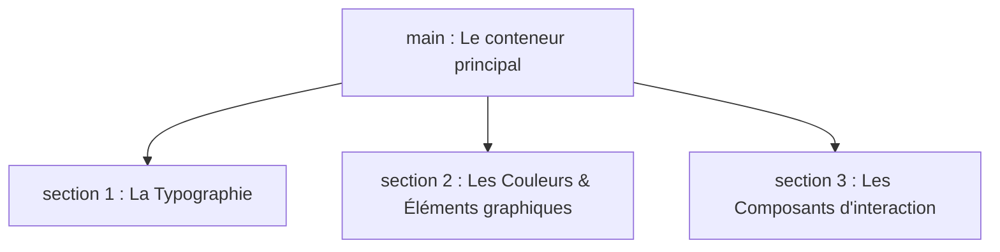

# TP : Création du Design System (Structure HTML)

## Objectif

Avant de donner du style à vos projets (CV et Formulaire), vous allez créer une page de référence. Cette page va lister tous les éléments visuels que vous utiliserez dans vos futur site.

Pour l'instant, la page sera brute et blanche. C'est normal : nous construisons uniquement le **squelette HTML**.

---

## La structure à coder (ui.html)

Votre fichier doit être structuré avec les balises sémantiques indispensables pour l'accessibilité. Voici le plan de votre page :

---

## Les éléments à intégrer dans chaque section

### Section 1 : La Typographie (`id="typography"`)

Cette section servira à tester vos futures polices de caractères et les tailles de vos textes.

* Les 6 niveaux de titres officiels : du titre principal `<h1>` jusqu'au plus petit `<h6>`.
* Un paragraphe de texte `
` avec :
    * du texte de remplissage (Lorem Ipsum).
    * un texte important mis en valeur avec la balise sémantique `<strong>`.
    * au moins 1 lien (`<a href="#">`)

### Section 2 : Les Composants et Formes (`id="components"`)

Ici, nous préparons les éléments visuels réutilisables.

* **Les boutons :** 
    * Créez trois balises `<button>`. Un bouton principal, un bouton secondaire, et un bouton désactivé (avec l'attribut `disabled`).
* **Les listes :** 
    * Une liste à puces non ordonnée (`<ul>` et `<li>`).
    * Une liste numérotée ordonnée (`<ol>` et `<li>`).

### Section 3 : Le formulaire de base (`id="forms"`)

Cette section valide les acquis sur les types d'inputs et l'accessibilité native.

Dans un `
` : 
    * Un champ de texte classique avec son `<label>` lié par un `id`.
    * Une zone de texte plus grande (`<textarea>`) pour les messages longs.
    * Un groupe de deux boutons radios (`<input type="radio">`) partageant le même attribut `name` pour tester un choix unique.

Dans un `<fieldset>` : 
    * Un champ de chaque [type](./html-09-formulaires.md#md-form-types) avec son label.

---

## 🟢 Les critères de validation du TP (Votre feuille de route)

Pour réussir ce TP et passer au vert, vous devez valider ces 4 points :

1. 📁 **Organisation :** Le projet est dans son propre dossier nommé `dwwm-design-system`, lié à un dépôt Git propre.
2. 🎯 **Accessibilité :** Chaque élément de formulaire (`<input>` ou `<textarea>`) possède un `<label>` correctement associé avec l'attribut `for`.
3. 🔤 **Conventions :** Le fichier s'appelle exactement `index.html` (en minuscules, sans espace).
4. 🛡️ **Arbitre W3C :** Votre code est copié et validé sans aucune erreur sur le Validateur officiel du W3C.