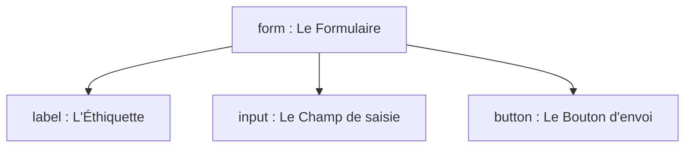

C'est exactement ça ! Les formulaires constituent la dernière grande étape du HTML de base avant de basculer vers le design (CSS) puis la programmation dynamique.

C'est un morceau particulièrement intéressant à enseigner car il crée un pont direct avec la logique de production : traitement des données, validation et interactivité.

---

# Cours : Les Formulaires en HTML (Interactivité et Saisie)

Un formulaire permet à l'utilisateur de saisir des données (texte, choix, fichiers) et de les envoyer vers un serveur pour qu'elles soient traitées.

---

## 1. Comprendre : Les trois éléments clés (Niveau 1 & 2 - Bloom)

Pour qu'un formulaire fonctionne et soit accessible, il repose sur l'association stricte de trois éléments fondamentaux.



* **`<form>`** : Le conteneur global du formulaire. Il définit où et comment envoyer les données grâce à ses attributs.
* **`<label>`** : L'étiquette textuelle qui explique à l'utilisateur ce qu'il doit saisir.
* **`<input>`** : Le champ de saisie où l'utilisateur tape ou sélectionne une information.

---

## 2. Appliquer : Créer un Formulaire Simple (Niveau 3 - Bloom)

Voici le code pour un formulaire de connexion classique.

```html
<form action="./connexion.php" method="POST">

  <p>
    <label for="identifiant">Nom d'utilisateur :</label>
    <input type="text" id="identifiant" name="username" required>
  </p>

  <p>
    <label for="mot-de-passe">Mot de passe :</label>
    <input type="password" id="mot-de-passe" name="password" required>
  </p>

  <button type="submit">Se connecter</button>

</form>

```

---

## 3. Analyser : Les Attributs Cruciaux (Niveau 4 - Bloom)

Les formulaires HTML s'appuient sur des attributs précis. Si l'un d'eux est oublié, le formulaire devient inutile ou inaccessible.

### A. Les attributs du conteneur `<form>`

* **`action`** : Indique l'adresse (URL ou script de destination) où les données doivent être envoyées (ex: `./traitement.php`).
* **`method`** : Définit comment les données voyagent.
* `GET` : Les données sont visibles directement dans l'adresse URL (utilisé pour des recherches).
* `POST` : Les données sont cachées dans le corps de la requête (obligatoire pour les mots de passe et les données sensibles).


### B. Le lien Label-Input (Règle d'Accessibilité TSA/TDAH/Malvoyance)

Pour lier un texte explicatif à son champ, l'attribut **`for`** du `<label>` doit être **strictement identique** à l'attribut **`id`** de l'`<input>`.

> **Pourquoi ?** Cela permet à un utilisateur de cliquer sur le texte pour activer le champ de saisie. Cela agrandit la zone cible, ce qui améliore le confort visuel et moteur.

### C. L'attribut indispensable pour le développeur backend : `name`

L'attribut **`name`** est l'identifiant de la donnée pour le serveur. Sans l'attribut `name`, la donnée saisie par l'utilisateur n'est tout simplement jamais envoyée au script PHP ou JavaScript.

---

## 4. Évaluer : Les Types d'Inputs courants (Niveau 5 - Bloom)

Le comportement de la balise orpheline `<input>` change complètement selon la valeur de son attribut `type`.

| Type d'Input | Code HTML | Rendu / Comportement |
| --- | --- | --- |
| **Texte standard** | `type="text"` | Un champ classique pour du texte libre (ex: un nom). |
| **Mot de passe** | `type="password"` | Masque automatiquement les caractères tapés par des puces. |
| **Email** | `type="email"` | Le navigateur vérifie automatiquement la présence d'un `@` et d'un point. |
| **Case à cocher** | `type="checkbox"` | Permet de cocher ou décocher une option (ex: "Accepter les conditions"). |
| **Bouton Radio** | `type="radio"` | Permet un choix unique parmi plusieurs options portant le même `name`. |