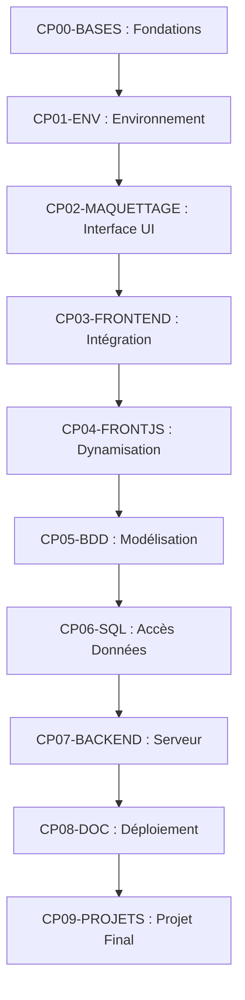

Voici le plan de formation complet pour le titre professionnel **Développeur Web et Web Mobile (DWWM)**. Ce plan est structuré selon une progression logique allant du concept vers la pratique (Taxonomie de Bloom). Le langage respecte la méthode **FALC** (Facile à Lire et à Comprendre) pour être accessible à tous les apprenants.

---

## Architecture Globale du Parcours

Le programme se compose de **10 modules interconnectés**. Chaque module suit les niveaux de la taxonomie de Bloom pour amener l'apprenant vers l'autonomie.

---

## Plan de Formation Détaillé

### Module CP00-BASES : Fondations du Web et Algorithmique

Ce module prépare les apprenants sans aucun prérequis technique.

* **Niveau 1 & 2 : Mémoriser et Comprendre**
* Définition de l'architecture du Web : client, serveur, protocoles HTTP et HTTPS.

* Compréhension des variables, des types de données et des structures de contrôle (boucles, conditions).

* **Niveau 3 & 4 : Appliquer et Analyser**
* Écriture de scripts algorithmiques simples.
* Analyse de la trace d'un programme pour comprendre son exécution.

* **Niveau 5 & 6 : Évaluer et Créer**
* Identification des erreurs de logique dans un algorithme donné.

* **Mini-projet :** Création d'un script autonome de traitement de données textuelles.

### Module CP01-ENV : Environnement de Travail Professionnel

REAC Visé : CP1 — Installer et configurer son environnement de travail en fonction du projet.
Standards : VS Code, Docker Compose V2, Git / GitHub Flow.

* **Niveau 1 & 2 : Mémoriser et Comprendre**
* Rôle du système de contrôle de version Git et des dépôts distants GitHub.

* Concept de conteneurisation avec Docker pour isoler les outils de développement.

* **Niveau 3 & 4 : Appliquer et Analyser**
* Configuration de l'éditeur VS Code avec des utilitaires de contrôle de qualité de code (Linters).

* Utilisation des commandes Git de base : branches, commits, push, pull et Pull Requests.

* Lancement de services locaux (serveur web, base de données) via Docker Compose V2.

* **Niveau 5 & 6 : Évaluer et Créer**
* Résolution de conflits de fusion (merge conflicts) lors d'un travail en équipe.

* **Mini-projet :** Création et partage d'un environnement Docker complet et standardisé pour un projet d'équipe.

### Module CP02-MAQUETTAGE : Conception UI/UX et Accessibilité

REAC Visé : CP2 — Maquetter des interfaces utilisateur web ou web mobile.
Standards : Wireframes, RGAA, Éco-conception, Recommandations ANSSI.

* **Niveau 1 & 2 : Mémoriser et Comprendre**
* Définition de l'expérience utilisateur (UX) et de l'interface utilisateur (UI).

* Règles du Référentiel Général d'Amélioration de l'Accessibilité (RGAA) pour le handicap.

* Principes fondamentaux de l'éco-conception et de la protection des données (RGPD/CNIL).

* **Niveau 3 & 4 : Appliquer et Analyser**
* Création de maquettes fonctionnelles (wireframes) adaptées aux écrans de bureaux et mobiles (Mobile First).

* Modélisation de l'enchaînement des écrans à l'aide d'un schéma de navigation utilisateur.

* **Niveau 5 & 6 : Évaluer et Créer**
* Audit d'une maquette existante par rapport aux critères de sécurité de l'ANSSI et d'accessibilité du RGAA.

* **Mini-projet :** Réalisation d'un dossier de prototypage complet pour un client, incluant la charte graphique et le schéma de navigation.

### Module CP03-FRONTEND : Intégration Statique et Normes du Web

REAC Visé : CP3 — Réaliser des interfaces utilisateur statiques web ou web mobile.
Standards : HTML5 sémantique, CSS3 (Flexbox, Grid), Méthodologie BEM.

* **Niveau 1 & 2 : Mémoriser et Comprendre**
* Rôle de la sémantique HTML5 pour le référencement naturel (SEO) et l'accessibilité.

* Compréhension de la cascade CSS, de la responsivité et du modèle de boîte.

* **Niveau 3 & 4 : Appliquer et Analyser**
* Intégration d'une maquette statique en utilisant HTML5 et CSS3 (Flexbox et Grid).

* Application de la méthodologie BEM pour structurer les classes CSS.

* Mise en place des mentions légales obligatoires liées au RGPD.

* **Niveau 5 & 6 : Évaluer et Créer**
* Validation du code produit via les outils de vérification officiels du W3C.

* **Mini-projet :** Intégration complète d'un site vitrine multipage, entièrement accessible, éco-conçu et déployé de manière sécurisée.

### Module CP04-FRONTJS : Dynamisation Client et Frameworks Interface

REAC Visé : CP4 — Développer la partie dynamique des interfaces utilisateur web ou web mobile.
Standards : JavaScript ES2023+, API REST, Vue 3 (Options API en ESM).

* **Niveau 1 & 2 : Mémoriser et Comprendre**
* Mécanismes de la manipulation du Document Object Model (DOM).

* Concept de programmation asynchrone (AJAX, Fetch API, Promesses).

* Principes de sécurité client : parer les failles Cross-Site Scripting (XSS).

* **Niveau 3 & 4 : Appliquer et Analyser**
* Gestion des événements de l'interface utilisateur (clics, soumissions de formulaires) en JavaScript moderne.

* Consommation et affichage de données provenant d'une API REST externe.

* Développement d'interfaces dynamiques réactives avec Vue 3 (Options API).

* **Niveau 5 & 6 : Évaluer et Créer**
* Débogage de scripts asynchrones à l'aide des outils de développement du navigateur.

* **Mini-projet :** Création d'une application web dynamique de gestion de catalogue connectée à une API, incluant la validation sécurisée des entrées utilisateur.

### Module CP05-BDD : Modélisation et Persistance des Données

REAC Visé : CP5 — Mettre en place une base de données relationnelle.
Standards : MariaDB 11+, PostgreSQL 15+.

* **Niveau 1 & 2 : Mémoriser et Comprendre**
* Concepts du modèle entité-association et de l'intégrité des données.

* Règles de normalisation des bases de données relationnelles (Formes Normales).

* **Niveau 3 & 4 : Appliquer et Analyser**
* Construction d'un schéma logique des données (SLD) à partir d'un cahier des charges métier.

* Écriture de scripts SQL de définition de données (création de tables, contraintes de clés primaires et étrangères).

* **Niveau 5 & 6 : Évaluer et Créer**
* Mise en place d'une stratégie de sauvegarde et de restauration de la base de données de test.

* **Mini-projet :** Création et initialisation d'une structure de base de données relationnelle complète avec un jeu d'essai métier réaliste.

### Module CP06-SQL : Composants d'Accès aux Données et Sécurité

REAC Visé : CP6 — Développer des composants d'accès aux données SQL et NoSQL.
Standards : Langage SQL, Requêtes paramétrées, Fondations OWASP.

* **Niveau 1 & 2 : Mémoriser et Comprendre**
* Fonctionnement des transactions SQL et gestion des conflits d'accès.

* Compréhension des risques liés aux attaques par injection SQL.

* Différences fondamentales entre les modèles relationnels (SQL) et non relationnels (NoSQL).

* **Niveau 3 & 4 : Appliquer et Analyser**
* Écriture de requêtes d'extraction complexes (jointures, regroupements) et de manipulation de données (CRUD).

* Sécurisation des accès à l'aide de requêtes paramétrées.

* **Niveau 5 & 6 : Évaluer et Créer**
* Analyse des performances d'une requête et correction des vulnérabilités de sécurité selon les guides OWASP.

* **Mini-projet :** Développement d'une couche d'accès aux données isolée et sécurisée, capable d'exécuter des transactions complexes sans altérer l'intégrité de la base.

### Module CP07-BACKEND : Développement Serveur et Framework Métier

REAC Visé : CP7 — Développer des composants métier côté serveur.
Standards : PHP 8.5+ (typage strict), Architecture MVC, Framework Symfony 7.x.

* **Niveau 1 & 2 : Mémoriser et Comprendre**
* Principes de la Programmation Orientée Objet (POO) : classes, encapsulation, héritage, interfaces.

* Fonctionnement de l'architecture logicielle multicouche et du patron de conception MVC (Modèle-Vue-Contrôleur).

* Concepts fondamentaux du développement défensif côté serveur.

* **Niveau 3 & 4 : Appliquer et Analyser**
* Création de composants métier typés en PHP 8.5+ avec gestion stricte des erreurs et des exceptions.

* Mise en place d'une architecture applicative sécurisée avec le framework Symfony 7.x.

* Implémentation des mécanismes d'authentification, de contrôle des droits d'accès (rôles) et de validation des formulaires.

* Écriture et automatisation de tests unitaires sur les composants critiques.

* **Niveau 5 & 6 : Évaluer et Créer**
* Refactoring de code existant pour améliorer sa qualité, sa sécurité et ses performances.

* **Mini-projet :** Développement de la partie back-end sécurisée d'une application de gestion, incluant une API interne, l'authentification des utilisateurs et la couverture par des tests unitaires.

### Module CP08-DOC : Déploiement et Culture DevOps

REAC Visé : CP8 — Documenter le déploiement d'une application dynamique web ou web mobile.
Standards : Scripts d'automatisation, Documentation bilingue (Français/Anglais Niveau B1).

* **Niveau 1 & 2 : Mémoriser et Comprendre**
* Compréhension du cycle de vie d'une application et de la démarche DevOps (intégration et déploiement continus).

* Différences entre les environnements de développement, de test (SIT), d'acceptation (UAT) et de production.

* **Niveau 3 & 4 : Appliquer et Analyser**
* Rédaction d'une procédure technique de déploiement claire, concise et structurée.

* Écriture de scripts de déploiement automatisés (mise à jour de base de données, exécution de tâches).

* **Niveau 5 & 6 : Évaluer et Créer**
* Vérification de la conformité d'un environnement de production cible par rapport aux dépendances de l'application.

* **Mini-projet :** Rédaction d'un dossier technique complet de déploiement bilingue (Français/Anglais) permettant la mise en production sans erreur d'une application dynamique.

---

## CP09-PROJETS : Cahier des Charges du Projet Final de Synthèse

Ce projet place l'apprenant dans les conditions réelles d'une entreprise pendant une durée d'environ un mois. Il valide l'ensemble des compétences du titre professionnel.

### 1. Contexte Professionnel Simulé

La société **"Eco-Loc"** souhaite lancer une plateforme web d'économie circulaire et collaborative permettant aux entreprises locales de louer ou de partager des équipements industriels et informatiques non utilisés.

### 2. Fonctionnalités Attendues (User Stories)

* **En tant que visiteur :** Je veux consulter le catalogue des équipements disponibles et filtrer par catégorie afin de trouver rapidement un outil proche de mon entreprise.

* **En tant qu'utilisateur inscrit (Professionnel) :** Je veux proposer un équipement à la location (titre, description, photo, tarif, règles d'éco-conception de l'objet) et gérer mes réservations reçues.

* **En tant qu'emprunteur :** Je veux réserver un équipement sur un calendrier dynamique et suivre l'état de ma demande.

* **En tant qu'administrateur :** Je veux modérer les annonces, gérer les rôles des utilisateurs et accéder à un tableau de bord des échanges dans le respect du RGPD.

### 3. Contraintes Techniques Imposées

* **Environnement & Versioning :** Initialisation obligatoire sous VS Code, conteneurisé avec Docker Compose V2, suivi sur un dépôt GitHub avec respect strict du GitHub Flow.

* **Front-end :** Interface statique sémantique HTML5, stylisée en CSS3 avec la méthodologie BEM. Dynamisation des composants via JavaScript ES2023+ et Vue 3 (Options API). Respect impératif des normes d'accessibilité RGAA.

* **Back-end & Données :** Base de données relationnelle MariaDB 11+ ou PostgreSQL 15+. Développement de la logique métier avec le framework Symfony 7.x en PHP 8.5+ (typage strict).

* **Sécurité :** Style de développement défensif, validation systématique de toutes les entrées utilisateur, protection totale contre les failles XSS, CSRF et injections SQL (normes ANSSI / OWASP).

* **Livrables DevOps :** Scripts d'initialisation, jeux d'essais automatisés et dossier technique complet de déploiement rédigé en français et en anglais.

### 4. Grille d'Évaluation des Compétences (Alignée REAC V04)

| Compétence Évaluée | Indicateurs Observables de Réussite |
| --- | --- |
| **CP1 : Environnement**  | L'environnement Docker démarre sans erreur. Le dépôt Git respecte le workflow imposé.

 |
| **CP2 : Maquettage**  | Présence d'un schéma logique d'enchaînement des écrans conforme au besoin client.

 |
| **CP3 : Interface Statique**  | Le code HTML5 est valide au W3C. La mise en page CSS est parfaitement responsive.

 |
| **CP4 : Partie Dynamique**  | Les appels API et les formulaires fonctionnent de manière asynchrone et sécurisée.

 |
| **CP5 : Base de Données**  | Le schéma logique élimine toute redondance inutile. Les contraintes d'intégrité sont actives.

 |
| **CP6 : Accès aux Données**  | Toutes les requêtes sont paramétrées. Aucune faille d'injection SQL n'est présente.

 |
| **CP7 : Composants Serveur**  | L'architecture MVC de Symfony est respectée. Le code PHP est strictement typé.

 |
| **CP8 : Déploiement**  | La documentation technique bilingue permet une mise en production pas à pas.

 |