# Le Fil Rouge Continu : Git, Docker et Documentation

Ces trois compétences ne sont plus des modules isolés. Elles sont pratiquées chaque jour, du début à la fin de la formation.

```mermaid
gantt
    title Intégration Continue des Compétences Transverses
    dateFormat  X
    axisFormat %s
    section Git / GitHub
    Bases (Commits, Push) : active, 0, 50
    Avancé (Branches, Pull Requests) : active, 50, 100
    section Docker
    Utilisation d'images simples (Web) : active, 20, 60
    Multi-conteneurs (Compose, BDD, PHP) : active, 60, 100
    section Documentation
    Commentaires et Readme d'installation : active, 0, 40
    Spécifications et Procédures de déploiement : active, 40, 100

```



---

## Plan de Formation Spiralaire

### Module 1 : Fondations et Algorithmique (CP00-BASES)

* **Concept clé :** Logique de programmation.


* **Intégration Git & Docker :** Apprentissage des commandes Git de base (`git init`, `commit`, `push`). Documentation du premier code dans un fichier `README.md`.


* **Application métier :**
* *Exemple :* Algorithme de calcul du rendu de monnaie pour l'**Application distributeur de boissons**.
* *TP :* Création de la logique de vérification des identifiants pour le système de **Gestion d'utilisateurs**.


### Module 2 : Conception et Prototypage UI/UX (CP02-MAQUETTAGE)

* **Concept clé :** Modélisation des besoins utilisateurs et accessibilité (RGAA).


* **Rappel du module précédent :** Reprise des règles logiques définies dans le module 1 pour concevoir les écrans.


* **Intégration Git & Docker :** Versioning des fichiers de conception et des schémas de navigation sur GitHub.


* **Application métier :**
* *Exemple :* Maquettage des écrans de sélection de l'**Application distributeur de boissons** (accessibilité des boutons).


* *TP :* Création du wireframe et du schéma de navigation pour le **Système de réservation de trajets**.


### Module 3 : Intégration Web Statique (CP03-FRONTEND)

* **Concept clé :** Structure HTML5 sémantique et design responsive CSS3.


* **Rappel du module précédent :** Traduction exacte en code des maquettes et des critères d'accessibilité validés au module 2.


* **Intégration Git & Docker :** Lancement du premier conteneur Docker (serveur web Nginx ou Apache) pour afficher le site en local.


* **Application métier :**
* *Exemple :* Intégration de l'interface utilisateur statique pour le **Système de réservation de trajets**.


* *TP :* Code HTML/CSS de la page d'accueil et des fiches descriptives pour le **Système de gestion d'événements**.


### Module 4 : Dynamisation Client (CP04-FRONTJS)

* **Concept clé :** Programmation JavaScript asynchrone et utilisation du framework Vue 3.


* **Rappel du module précédent :** Utilisation de l'intégration HTML/CSS du module 3 pour la rendre dynamique.


* **Intégration Git & Docker :** Utilisation du flux collaboratif GitHub Flow (création de branches distinctes et Pull Requests par fonctionnalité).


* **Application métier :**
* *Exemple :* Mise à jour en temps réel des places disponibles pour le **Système de gestion d'événements** avec Vue 3.


* *TP :* Dynamisation du choix des produits et gestion du panier virtuel pour l'**Application distributeur de boissons**.


### Module 5 : Persistance et Accès aux Données (CP05-BDD / CP06-SQL)

* **Concept clé :** Modélisation relationnelle et requêtes SQL sécurisées.


* **Rappel du module précédent :** Structuration des données qui alimentaient jusqu'ici dynamiquement les interfaces du module 4.


* **Intégration Git & Docker :** Ajout d'un conteneur MariaDB au fichier `docker-compose.yml` de l'apprenant. Documentation des scripts de création SQL.


* **Application métier :**
* *Exemple :* Modélisation et requêtes de l'historique des achats pour le système de **Gestion d'utilisateurs**.


* *TP :* Conception de la base de données et écriture des requêtes d'association (conducteurs, passagers, trajets) pour le **Système de réservation de trajets**.


### Module 6 : Logique Métier Serveur (CP07-BACKEND / CP08-DOC)

* **Concept clé :** Architecture MVC, sécurité applicative (Symfony 7.x) et documentation de déploiement.


* **Rappel du module précédent :** Connexion du serveur aux tables SQL créées au module 5 et traitement des données reçues des formulaires du module 4.


* **Intégration Git & Docker :** Environnement Docker complet (Serveur Web + PHP 8.5+ + MariaDB). Rédaction de la procédure technique finale de déploiement en français et en anglais.


* **Application métier :**
* *Exemple :* Développement des contrôleurs et de la sécurité d'accès selon les rôles pour le système de **Gestion d'utilisateurs**.


* *TP :* Code complet de la logique de réservation, validation des paiements fictifs et génération des billets pour le **Système de gestion d'événements**.


---

## Phase Finale : Le Projet Réel d'Un Mois (CP09-PROJETS)

Pour valider leur titre, les apprenants choisissent l'un des **4 sujets officiels**. Ils le réalisent de manière totalement autonome en conditions réelles d'agence web.

```
┌──────────────────────────────────────────────────────────────────────────┐
│                     LIVRABLES ATTENDUS DE FIN DE PROJET                   │
├──────────────────────────────────────────────────────────────────────────┤
│ 1. Un dépôt GitHub contenant un historique propre (GitHub Flow)           │
│ 2. Un fichier "docker-compose.yml" permettant de lancer le projet en 1s  │
│ 3. Un dossier de maquettage et de spécifications (RGAA & RGPD inclus)    │
│ 4. Une application Web Full-Stack fonctionnelle (Vue 3 / Symfony 7)      │
│ 5. Une documentation bilingue de déploiement (README.md + DEPLOY.md)      │
└──────────────────────────────────────────────────────────────────────────┘

```